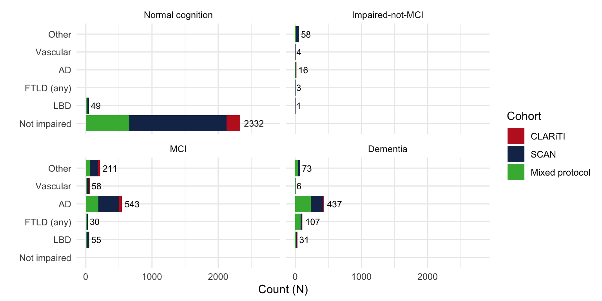
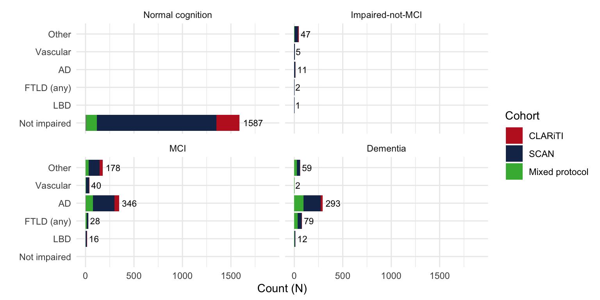
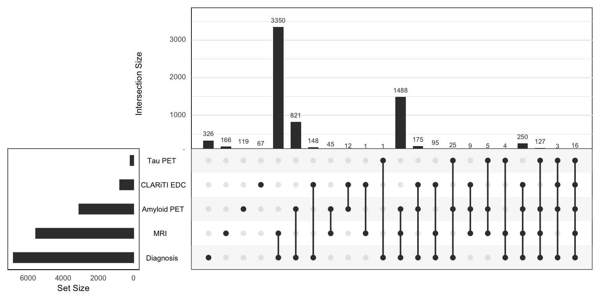

# NACCADRC Basic Summaries

Code

``` r

library(NACCADRC)
library(ggplot2)
library(tidyverse)
library(nlme)
library(data.table)
library(gtsummary)
library(UpSetR)
library(patchwork)

data(mrisbm, taupetnpdka, phc_cognition, amyloidpetgaain, 
uds_ftldlbd, clariti_edc, uds_mri)

# Data print function
datatable <- function(data, paging = FALSE, searchable = TRUE, bInfo = FALSE, ...) {
DT::datatable(
data = data, ...,
options = list(paging = paging, searchable = searchable, bInfo = bInfo, ...)
)
}
```

## Merge key imaging and PHC cognitive data

Code

``` r

## Combine hippocampal volume from SCAN and Mixed Protocol (UDS) ----
mri_hipp <- mrisbm %>%          # SCAN volumes
  select(SOURCE, NACCID, DATE = SCANDT, HIPPOCAMPUS, ICV = CEREBRUMTCV) %>%
  bind_rows(uds_mri %>%         # Mixed Protocol (UDS) volumes
    select(NACCID, MRIYR, MRIMO, MRIDY, HIPPOCAMPUS = HIPPOVOL, ICV = NACCICV) %>%
    filter(HIPPOCAMPUS != 88.8888, ICV != 9999.999, !is.na(HIPPOCAMPUS)) %>%
    mutate(
      DATE = as.IDate(paste(MRIYR, MRIMO, MRIDY, sep='-')),
      SOURCE = 'Mixed protocol')) %>%
  distinct(NACCID, DATE, .keep_all = TRUE)

NACCETPR_levels <- names(rev(sort(table(uds_ftldlbd$NACCETPR))))

## Combine hipp volume, tau PET, amyloid PET, cognition, and demographics ----
dd_atn <- clariti_edc %>% 
  select(NACCID) %>% distinct() %>% mutate(`CLARiTI EDC` = 'Yes') %>%
  left_join(mri_hipp %>%                 # Hippocampal volumes
      select(NACCID, MRI_SOURCE = SOURCE, DATE, HIPPOCAMPUS, ICV),
    by = 'NACCID') %>%
  full_join(taupetnpdka %>%
      arrange(NACCID, SCANDATE, desc(PROCESSDATE)) %>%
      distinct(NACCID, SCANDATE, .keep_all = TRUE) %>%
      select(NACCID, DATE = SCANDATE, Tau_PET = META_TEMPORAL_SUVR, 
        Tau_TRACER = TRACER, Tau_SOURCE = SOURCE) %>%
      distinct(NACCID, DATE, .keep_all = TRUE),
    by = c('NACCID', 'DATE')) %>%
  full_join(amyloidpetgaain %>%          # Amyloid PET
      arrange(NACCID, SCANDATE, desc(PROCESSDATE)) %>%
      distinct(NACCID, SCANDATE, .keep_all = TRUE) %>%
      select(NACCID, DATE = SCANDATE, AMYLOID_STATUS, CENTILOIDS, 
        Amyloid_TRACER = TRACER, Amyloid_SOURCE = SOURCE) %>%
      distinct(NACCID, DATE, .keep_all = TRUE),
    by = c('NACCID', 'DATE')) %>%
  full_join(phc_cognition %>%            # Harmonized cognition
      select(NACCID, NACCVNUM, PHC_MEM, PHC_EXF, PHC_LAN) %>%
      left_join(uds_ftldlbd %>%          # UDS visit dates
          select(NACCID, NACCVNUM, DATE = VISITDATE),
        by = c('NACCID', 'NACCVNUM')),
    by = c('NACCID', 'DATE'))

dd <- dd_atn %>%
  full_join(uds_ftldlbd %>%              # UDS diagnosis, etiology over time
      filter(NACCID %in% c(dd_atn$NACCID, clariti_edc$NACCID)) %>%
      mutate(
        NACCETPR = factor(NACCETPR, levels = NACCETPR_levels)) %>%
      select(NACCID, DATE = VISITDATE, NACCUDSD, NACCETPR),
    by = c('NACCID', 'DATE')) %>%
  left_join(uds_ftldlbd %>%              # UDS demographics
      mutate(BIRTHDATE = as.IDate(paste(BIRTHYR, BIRTHMO, 15, sep = '-'))) %>%
      filter(!is.na(BIRTHDATE)) %>%
      arrange(NACCID, NACCVNUM) %>%
      select(NACCID, BIRTHDATE, RACE, SEX = NACCSEX, EDUC, HISPANIC = NACCHISP) %>%
      group_by(NACCID) %>%               # Carry information back/forward
      tidyr::fill(.direction = "updown") %>% # to impute missing data
      ungroup() %>%
      filter(!duplicated(NACCID)),       # One row of demographics per NACCID
    by = 'NACCID') %>%
  arrange(NACCID, DATE) %>%
  group_by(NACCID) %>%                   # Carry Dx information forward/back
  tidyr::fill(all_of(c("NACCUDSD", "NACCETPR")), .direction = "downup") %>%
  mutate(ICV = mean(ICV, na.rm = TRUE)) %>% # Average ICV over visits
  ungroup() %>%
  mutate(
    Age = as.numeric(DATE - BIRTHDATE)/365.25,
    Etiology = case_when(                     # Simplified/collapse diagnosis
      NACCETPR == 'Not applicable, not cognitively impaired' ~ 'Not impaired',
      NACCETPR == "Alzheimer's disease (AD)" ~ 'AD',
      NACCETPR == 'Lewy body disease (LBD)' ~ 'LBD',
      NACCETPR %in% c("FTLD, other", "FTLD with motor neuron disease (e.g., ALS)") ~ 
        "FTLD (any)",
      NACCETPR == "Vascular brain injury or vascular dementia including stroke" ~ "Vascular",
      TRUE ~ 'Other') %>%
      factor(levels = c('Not impaired', 'LBD', "FTLD (any)", 'AD', "Vascular", 'Other')),
    NACCUDSD = case_when(
      is.na(NACCUDSD) ~ 'Unknown',
      TRUE ~ NACCUDSD) %>%
      factor(levels = c("Normal cognition", "Impaired-not-MCI", 
        "MCI", "Dementia", 'Unknown')))

CLARiTI_id <- dd %>%
  filter(MRI_SOURCE == 'CLARiTI' | Tau_SOURCE == 'CLARiTI' | Amyloid_SOURCE == 'CLARiTI') %>%
  pull(NACCID) %>% unique()

SCAN_id <- dd %>%
  filter(MRI_SOURCE == 'SCAN' | Tau_SOURCE == 'SCAN' | Amyloid_SOURCE == 'SCAN') %>%
  pull(NACCID) %>% unique() %>%
  setdiff(CLARiTI_id)

Mixed_id <- setdiff(dd$NACCID, c(CLARiTI_id, SCAN_id))

dd_cross <- dd %>%
  group_by(NACCID) %>%
  fill(everything(), .direction = "updown") %>%
  filter(!duplicated(NACCID)) %>%
  ungroup() %>%
  mutate(    # add labels for tables
    Cohort = case_when(
      NACCID %in% clariti_edc$NACCID ~ 'CLARiTI',
      NACCID %in% CLARiTI_id ~ 'CLARiTI',
      NACCID %in% SCAN_id ~ 'SCAN',
      TRUE ~ 'Mixed protocol'),
    PHC_MEM = structure(PHC_MEM, label = 'Harmonized Memory'),
    PHC_EXF = structure(PHC_EXF, label = 'Harmonized Exec Function'), 
    PHC_LAN = structure(PHC_LAN, label = 'Harmonized Language'),
    EDUC = structure(EDUC, label = 'Education (yrs)'),
    Age = structure(Age, label = 'Age (yrs)'),
    SEX = structure(SEX, label = 'Sex'),
    RACE = structure(RACE, label = 'Race'),
    HISPANIC = structure(HISPANIC, label = 'Hispanic'),
    AMYLOID_STATUS = structure(AMYLOID_STATUS, label = 'Amyloid status'),
    CENTILOIDS = structure(CENTILOIDS, label = 'Amyloid (CL)'),
    HIPPOCAMPUS = structure(HIPPOCAMPUS, label = 'Hippocampal volume (mm3)'),
    Tau_PET = structure(Tau_PET, label = 'Tau PET (SUVR)'),
    Tau_TRACER = structure(Tau_TRACER, label = 'Tau PET tracer'),
    NACCETPR = structure(NACCETPR, label = 'Primary etiologic diagnosis'),
    NACCUDSD = structure(NACCUDSD, label = 'Cognitive status at UDS visit'))

# harmonize tau PET data ----
tmp <- dd %>% filter(!is.na(Tau_PET) & !is.na(Age))
tau_PET_fit <- lme(Tau_PET ~ Tau_TRACER + SEX + Age, data = tmp,
  random = ~ 1 | NACCID,
  weights = varIdent(form = ~ 1 | Tau_TRACER))
tmp$Tau_PET_ComBat <- ComBat(Tau_PET ~ Tau_TRACER + SEX + Age, data = tmp,
  random1 = ~ 1 | NACCID, random2 = NULL,
  weights = varIdent(form = ~ 1 | Tau_TRACER))

dd <- dd %>%
  left_join(tmp %>% select(NACCID, DATE, Tau_PET_ComBat), 
    by = c('NACCID', 'DATE'))
```

## Summarize data collection

### Bar charts

Code

``` r

plot_data <- dd_cross %>% 
  filter(Cohort == 'CLARiTI') %>%
  filter(NACCUDSD != 'Unknown') %>%
  mutate(across(where(is.factor), fct_drop)) %>%
  group_by(NACCUDSD, Etiology) %>%
  summarise(n = n(), .groups = "drop")
ggplot(plot_data, aes(x = n, y = Etiology)) +
  geom_bar(stat = "identity") +
  geom_text(aes(label = n), hjust = -0.2, size = 3) +
  expand_limits(x = max(plot_data$n) * 1.2) +
  facet_wrap(vars(NACCUDSD)) +
  labs(y = "", x = "Count (N)")
```


Figure 1: Number of CLARiTI pariticpants by etiology and UDS clinical
diagnosis.

Code

``` r

count_data <- dd_cross %>% 
  filter(NACCUDSD != 'Unknown') %>%
  mutate(across(where(is.factor), fct_drop)) %>%
  group_by(NACCUDSD, Etiology) %>%
  summarise(n = n(), .groups = "drop")

dd_cross %>% 
  filter(NACCUDSD != 'Unknown') %>%
  mutate(across(where(is.factor), fct_drop)) %>%
  group_by(NACCUDSD, Etiology, Cohort) %>%
  summarise(n = n(), .groups = "drop") %>%
ggplot(aes(x = n, y = Etiology)) +
  geom_bar(aes(fill = Cohort), stat = "identity") +
  geom_text(data = count_data, aes(label = n), 
    hjust = -0.2, size = 3) +
  expand_limits(x = max(count_data$n) * 1.2) +
  facet_wrap(vars(NACCUDSD)) +
  labs(y = "", x = "Count (N)")
```


Figure 2: Number of pariticpants including CLARiTI, SCAN, and
mixed-protocol by etiology and UDS clinical diagnosis.

Code

``` r

count_data <- dd_cross %>% 
  filter(NACCUDSD != 'Unknown' & !is.na(CENTILOIDS)) %>%
  mutate(across(where(is.factor), fct_drop)) %>%
  group_by(NACCUDSD, Etiology) %>%
  summarise(n = n(), .groups = "drop")

dd_cross %>% 
  filter(NACCUDSD != 'Unknown' & !is.na(CENTILOIDS)) %>%
  mutate(across(where(is.factor), fct_drop)) %>%
  group_by(NACCUDSD, Etiology, Cohort) %>%
  summarise(n = n(), .groups = "drop") %>%
ggplot(aes(x = n, y = Etiology)) +
  geom_bar(aes(fill = Cohort), stat = "identity") +
  geom_text(data = count_data, aes(label = n), 
    hjust = -0.2, size = 3) +
  expand_limits(x = max(count_data$n) * 1.2) +
  facet_wrap(vars(NACCUDSD)) +
  labs(y = "", x = "Count (N)")
```



Figure 3: Number of pariticpants with amyloid PET, including CLARiTI,
SCAN, and mixed-protocol by etiology and UDS clinical diagnosis.

Code

``` r

count_data <- dd_cross %>% 
  filter(NACCUDSD != 'Unknown' & !is.na(Tau_PET)) %>%
  mutate(across(where(is.factor), fct_drop)) %>%
  group_by(NACCUDSD, Etiology) %>%
  summarise(n = n(), .groups = "drop")

dd_cross %>% 
  filter(NACCUDSD != 'Unknown' & !is.na(Tau_PET)) %>%
  mutate(across(where(is.factor), fct_drop)) %>%
  group_by(NACCUDSD, Etiology, Cohort) %>%
  summarise(n = n(), .groups = "drop") %>%
ggplot(aes(x = n, y = Etiology)) +
  geom_bar(aes(fill = Cohort), stat = "identity") +
  geom_text(data = count_data, aes(label = n), 
    hjust = -0.2, size = 3) +
  expand_limits(x = max(count_data$n) * 1.2) +
  facet_wrap(vars(NACCUDSD)) +
  labs(y = "", x = "Count (N)")
```



Figure 4: Number of pariticpants with tau PET, including CLARiTI, SCAN,
and mixed-protocol by etiology and UDS clinical diagnosis.

### UpSet plots

Code

``` r

dd_upset <- dd_cross %>%
  mutate(
    `CLARiTI EDC` = case_when(`CLARiTI EDC` == 'Yes' ~ 1, TRUE ~ 0),
    Diagnosis = case_when(!is.na(NACCUDSD) &  NACCUDSD != "Unknown" ~ 1, TRUE ~ 0),
    MRI = case_when(!is.na(HIPPOCAMPUS) ~ 1, TRUE ~ 0),
    `Amyloid PET` = case_when(!is.na(CENTILOIDS) ~ 1, TRUE ~ 0),
    `Tau PET` = case_when(!is.na(Tau_PET) ~ 1, TRUE ~ 0)) %>%
  select(NACCID, Cohort, `CLARiTI EDC`, Diagnosis:`Tau PET`) %>%
  as.data.frame()

upset(subset(dd_upset, Cohort == 'CLARiTI'), nsets = 7, nintersects = 30, mb.ratio = c(0.5, 0.5),
  order.by = c("freq", "degree"), decreasing = c(TRUE,FALSE))
```


Figure 5: UpSet plot of CLARiTI participants.

Code

``` r

upset(subset(dd_upset, Cohort %in% c('CLARiTI', 'SCAN')), 
  nsets = 7, nintersects = 30, mb.ratio = c(0.5, 0.5),
  order.by = c("freq", "degree"), decreasing = c(TRUE,FALSE))
```



Figure 6: UpSet plot of CLARiTI and SCAN participants.

Code

``` r

upset(dd_upset, nsets = 7, nintersects = 30, mb.ratio = c(0.5, 0.5),
  order.by = c("freq", "degree"), decreasing = c(TRUE,FALSE))
```


Figure 7: UpSet plot of all participants.

### Scan counts

Code

``` r

tmp <- dd %>% 
  select(NACCID, CENTILOIDS, HIPPOCAMPUS, Tau_PET_ComBat) %>%
  rename(
    `Amyloid PET` = CENTILOIDS, `Volumetric MRI` = HIPPOCAMPUS, 
    `Tau PET` = Tau_PET_ComBat) %>%
  group_by(NACCID) %>%
  pivot_longer(`Amyloid PET`:`Tau PET`) %>%
  filter(!is.na(value)) %>%
  mutate(Type = factor(name, levels = c(
    "Amyloid PET", "Tau PET", "Volumetric MRI"))) %>%
  group_by(Type, NACCID) %>%
  summarise(`Serial scans` = n())

with(tmp, table(Type, `Serial scans`)) %>% 
  knitr::kable(caption = "Number of individuals who have received the given number serial scans for each scan type.")
```

|                |    1 |    2 |   3 |   4 |   5 |   6 |   7 |   9 |
|:---------------|-----:|-----:|----:|----:|----:|----:|----:|----:|
| Amyloid PET    | 3665 |  494 |  40 |   7 |   0 |   0 |   0 |   0 |
| Tau PET        | 2107 |  293 |  27 |   2 |   0 |   0 |   0 |   0 |
| Volumetric MRI | 5175 | 1310 | 470 | 122 |  27 |  18 |   3 |   1 |

Table 1: Number of individuals who have received the given number serial
scans for each scan type.

### Cummulative scans by time from first scan

Code

``` r

dd %>% 
  select(NACCID, Age, Etiology, NACCUDSD, NACCETPR,
    CENTILOIDS, HIPPOCAMPUS, Tau_PET_ComBat) %>%
  rename(
    `Amyloid PET` = CENTILOIDS, `Volumetric MRI` = HIPPOCAMPUS, 
    `Tau PET` = Tau_PET_ComBat) %>%
  pivot_longer(`Amyloid PET`:`Tau PET`) %>%
  filter(!is.na(value), !is.na(Age), !is.na(NACCUDSD)) %>%
  mutate(Type = factor(name, levels = c(
    "Amyloid PET", "Tau PET", "Volumetric MRI"))) %>%
  group_by(NACCID, Type) %>%
  mutate(
    Age0 = min(Age, na.rm = TRUE),
    `Initial Dx` = case_when(
      Age == Age0 ~ NACCUDSD,
      TRUE ~ NA),
    Years = Age - Age0) %>%
  arrange(NACCID, Years) %>%
  tidyr::fill(all_of("Initial Dx"), .direction = "down") %>%
  group_by(Type, Years) %>%
  summarise(count = n()) %>%
  mutate(`Cumulative count` = cumsum(count)) %>%
ggplot(aes(x=Years, y=`Cumulative count`, color = Type)) +
  geom_line() +
  xlab('Years from first scan of each type')
```


Figure 8: Cumulative scans by time from first scan of each scan type.

## Baseline characteristics

### CLARiTI participants

Code

``` r

tbl_summary(
  data = dd_cross %>% filter(Cohort == 'CLARiTI') %>%
    mutate(across(where(is.factor), fct_drop)),
  by = NACCUDSD,
  include = c("CLARiTI EDC", "Etiology", "Age", "SEX", "EDUC", "RACE", "HISPANIC", "AMYLOID_STATUS", "CENTILOIDS", "HIPPOCAMPUS", "Tau_PET", "Tau_TRACER", "PHC_MEM", "PHC_EXF", "PHC_LAN"),
  type = all_continuous() ~ "continuous2",
  statistic = list(
    all_continuous() ~ c(
      "{mean} ({sd})",
      "{median} ({p25}, {p75})",
      "{min}, {max}"),
    all_categorical() ~ "{n} ({p}%)"),
  digits = all_continuous() ~ 1,
  percent = "row",
  missing_text = "(Missing)") %>%
  add_overall(last = TRUE) %>%
  add_stat_label(label = all_continuous2() ~ c("Mean (SD)", "Median (Q1, Q3)", "Range")) %>%
  modify_caption(caption = "Characteristics of CLARiTI participants by baseline UDS diagnosis. Note CLARiTI participants are those with a NACCID in clariti_edc or any of the CLARiTI imaging summary files.") %>%
  modify_footnote_header(
    footnote = "Row-wise percentage; n (%)",
    columns = all_stat_cols(),
    replace = TRUE) %>%
  bold_labels()
```

[TABLE]

Table 2: Characteristics of CLARiTI participants by baseline UDS
diagnosis. Note CLARiTI participants are those with a NACCID in
clariti_edc or any of the CLARiTI imaging summary files.

### All participants

Code

``` r

tbl_summary(
  data = dd_cross %>%
    mutate(across(where(is.factor), fct_drop)),
  by = NACCUDSD,
  include = c("Etiology", "Age", "SEX", "EDUC", "RACE", "HISPANIC", "AMYLOID_STATUS", "CENTILOIDS", "HIPPOCAMPUS", "Tau_PET", "Tau_TRACER", "PHC_MEM", "PHC_EXF", "PHC_LAN"),
  type = all_continuous() ~ "continuous2",
  statistic = list(all_continuous() ~ c(
    "{mean} ({sd})",
    "{median} ({p25}, {p75})",
    "{min}, {max}"),
    all_categorical() ~ "{n} ({p}%)"),
  digits = all_continuous() ~ 1,
  percent = "row",
  missing_text = "(Missing)") %>%
  add_overall(last = TRUE) %>%
  add_stat_label(label = all_continuous2() ~ c("Mean (SD)", "Median (Q1, Q3)", "Range")) %>%
  modify_caption(caption = "Characteristics of all participants by baseline UDS diagnosis.") %>%
  modify_footnote_header(
    footnote = "Row-wise percentage; n (%)",
    columns = all_stat_cols(),
    replace = TRUE) %>%
  bold_labels()
```

[TABLE]

Table 3: Characteristics of all participants by baseline UDS diagnosis.

### Participants with hippocampal volumes

Code

``` r

tbl_summary(
  data = dd_cross %>% filter(!is.na(HIPPOCAMPUS)) %>%
    mutate(across(where(is.factor), fct_drop)),
  by = NACCUDSD,
  include = c("Etiology", "Age", "SEX", "EDUC", "RACE", "HISPANIC", "AMYLOID_STATUS", "CENTILOIDS", "HIPPOCAMPUS", "Tau_PET", "Tau_TRACER", "PHC_MEM", "PHC_EXF", "PHC_LAN"),
  type = all_continuous() ~ "continuous2",
  statistic = list(all_continuous() ~ c(
    "{mean} ({sd})",
    "{median} ({p25}, {p75})",
    "{min}, {max}"
  ),
    all_categorical() ~ "{n} ({p}%)"),
  digits = all_continuous() ~ 1,
  percent = "row",
  missing_text = "(Missing)") %>%
  add_overall(last = TRUE) %>%
  add_stat_label(label = all_continuous2() ~ c("Mean (SD)", 
    "Median (Q1, Q3)", "Range")) %>%
  modify_caption(caption = "Characteristics of all participants with MRI data by baseline UDS diagnosis.") %>%
  modify_footnote_header(
    footnote = "Row-wise percentage; n (%)",
    columns = all_stat_cols(),
    replace = TRUE) %>%
  bold_labels()
```

[TABLE]

Table 4: Characteristics of all participants with MRI data by baseline
UDS diagnosis.

### Participants with tau PET

Code

``` r

tbl_summary(
  data = dd_cross %>% filter(!is.na(Tau_PET)) %>%
    mutate(across(where(is.factor), fct_drop)),
  by = NACCUDSD,
  include = c("Etiology", "Age", "SEX", "EDUC", "RACE", "HISPANIC", "AMYLOID_STATUS", "CENTILOIDS", "HIPPOCAMPUS", "Tau_PET", "Tau_TRACER", "PHC_MEM", "PHC_EXF", "PHC_LAN"),
  type = all_continuous() ~ "continuous2",
  statistic = list(all_continuous() ~ c(
    "{mean} ({sd})",
    "{median} ({p25}, {p75})",
    "{min}, {max}"),
    all_categorical() ~ "{n} ({p}%)"),
  digits = all_continuous() ~ 1,
  percent = "row",
  missing_text = "(Missing)") %>%
  add_overall(last = TRUE) %>%
  add_stat_label(label = all_continuous2() ~ c("Mean (SD)", "Median (Q1, Q3)", "Range")) %>%
  modify_caption(caption = "Characteristics of all participants with tau PET data by baseline UDS diagnosis.") %>%
  modify_footnote_header(
    footnote = "Row-wise percentage; n (%)",
    columns = all_stat_cols(),
    replace = TRUE) %>%
  bold_labels()
```

[TABLE]

Table 5: Characteristics of all participants with tau PET data by
baseline UDS diagnosis.

### Participants with amyloid PET

Code

``` r

tbl_summary(
  data = dd_cross %>% filter(!is.na(CENTILOIDS)) %>%
    mutate(across(where(is.factor), fct_drop)),
  by = NACCUDSD,
  include = c("Etiology", "Age", "SEX", "EDUC", "RACE", "HISPANIC", "AMYLOID_STATUS", "CENTILOIDS", "HIPPOCAMPUS", "Tau_PET", "Tau_TRACER", "PHC_MEM", "PHC_EXF", "PHC_LAN"),
  type = all_continuous() ~ "continuous2",
  statistic = list(all_continuous() ~ c(
    "{mean} ({sd})",
    "{median} ({p25}, {p75})",
    "{min}, {max}"
  ),
    all_categorical() ~ "{n} ({p}%)"),
  digits = all_continuous() ~ 1,
  percent = "row",
  missing_text = "(Missing)") %>%
  add_overall(last = TRUE) %>%
  add_stat_label(label = all_continuous2() ~ c("Mean (SD)", "Median (Q1, Q3)", "Range")) %>%
  modify_caption(caption = "Characteristics of NACC ADRC participants with amyloid PET data by baseline UDS diagnosis.") %>%
  modify_footnote_header(
    footnote = "Row-wise percentage; n (%)",
    columns = all_stat_cols(),
    replace = TRUE) %>%
  bold_labels()
```

[TABLE]

Table 6: Characteristics of NACC ADRC participants with amyloid PET data
by baseline UDS diagnosis.

## Summary plots

### LOESS Trends

Code

``` r

pd1 <- dd %>% 
  select(NACCID, Age, Etiology, NACCUDSD, NACCETPR,
    CENTILOIDS, HIPPOCAMPUS, Tau_PET_ComBat) %>%
  rename(
    `Amyloid PET (CL)` = CENTILOIDS, `Hipp. volume` = HIPPOCAMPUS, 
    `Tau PET (MTL SUVR)` = Tau_PET_ComBat) %>%
  group_by(NACCID) %>%
  mutate(
    Age0 = min(Age),
    `Initial Dx` = case_when(
      Age == Age0 ~ NACCUDSD,
      TRUE ~ NA),
    Years = Age - Age0) %>%
  arrange(NACCID, Years) %>%
  tidyr::fill(all_of("Initial Dx"), .direction = "down") %>%
  pivot_longer(`Amyloid PET (CL)`:`Tau PET (MTL SUVR)`) %>%
  filter(!is.na(value), !is.na(Years), !is.na(NACCUDSD)) %>%
  mutate(name = factor(name, levels = c(
    "Amyloid PET (CL)", "Tau PET (MTL SUVR)", "Hipp. volume")))

pd2_0 <- dd %>% 
  select(NACCID, Age, Memory = PHC_MEM, Etiology, NACCUDSD, NACCETPR,
    CENTILOIDS, HIPPOCAMPUS, Tau_PET_ComBat) %>%
  group_by(NACCID) %>%
  mutate(
    Age0 = min(Age),
    `Initial Dx` = case_when(
      Age == Age0 ~ NACCUDSD,
      TRUE ~ NA),
    Years = Age - Age0) %>%
  arrange(NACCID, Years) %>%
  tidyr::fill(all_of("Initial Dx"), .direction = "down") %>%
  mutate(
    Dx0 = `Initial Dx`,
    Memory_int = zoo::na.approx(Memory, na.rm = FALSE)) %>%
  select(NACCID, Age, `Initial Dx`, Dx0, Memory, Memory_int, Etiology, 
    NACCUDSD, NACCETPR, CENTILOIDS, HIPPOCAMPUS, Tau_PET_ComBat) %>%
  filter(!is.na(Age)) %>%
  ungroup()

fit_mem <- lme(Memory ~ I(Age^3)*Dx0, 
  random = ~ Age | NACCID, data = pd2_0, na.action = na.omit)
pd2_0$Memory_lme <- predict(fit_mem, newdata = pd2_0 %>% select(-Memory)) %>%
  as.numeric()

pd2 <- pd2_0 %>%
  mutate(
    Memory_i = case_when(
      !is.na(Memory) ~ Memory,
      !is.na(Memory_int) ~ Memory_int,
      !is.na(Memory_lme) ~ Memory_lme)) %>%
  rename(
    `Amyloid PET (CL)` = CENTILOIDS, `Hipp. volume` = HIPPOCAMPUS, 
    `Tau PET (MTL SUVR)` = Tau_PET_ComBat) %>%
  pivot_longer(`Amyloid PET (CL)`:`Tau PET (MTL SUVR)`) %>%
  filter(!is.na(value), !is.na(Memory_i), !is.na(NACCUDSD)) %>%
  mutate(name = factor(name, levels = c(
    "Amyloid PET (CL)", "Tau PET (MTL SUVR)", "Hipp. volume")))

p1 <- ggplot(pd1, aes(x=Age, y=value, color = `Initial Dx`)) +
  facet_wrap(vars(name), scales = 'free_y', ncol = 3, strip.position = "left") +
  geom_smooth(method = 'gam', formula = y ~ s(x, bs = "cs", fx = TRUE, k = 1)) +
  coord_cartesian(xlim = c(50, 90)) +
  ylab('') +
  theme(strip.placement = "outside")

p2 <- ggplot(pd2, aes(x=Memory_i, y=value, color = `Initial Dx`)) +
  facet_wrap(vars(name), scales = 'free_y', ncol = 3, strip.position = "left") +
  geom_smooth(method = 'gam', formula = y ~ s(x, bs = "cs", fx = TRUE, k = 1)) +
  # coord_cartesian(xlim = c(50, 90)) +
  ylab('Amyloid PET (CL)') +
  xlab('Harmonized Memory (imputed)') +
  scale_x_reverse() +
  ylab('') +
  theme(strip.placement = "outside")

p1 / p2 + plot_layout(guides = "collect")
```


LOESS plots. For the bottom plot, memory scores are imputed using linear
interpolation (when possible) and a linear mixed effects model (when
interpolation was not possible) to allow for plotting against biomarker
values. The linear mixed effects model included fixed effects for age
(as a cubic polynomial) by initial diagnosis. Random effects included
random intercepts and slopes for each participant.

### Spaghetti plots

Code

``` r

pd <- dd %>% 
  select(NACCID, SOURCE = Amyloid_SOURCE, Etiology, Age, NACCUDSD, NACCETPR, CENTILOIDS) %>%
  filter(!is.na(CENTILOIDS), !is.na(Age)) %>%
  group_by(NACCID) %>%
  mutate(
    Age0 = min(Age),
    `Initial Dx` = case_when(
      Age == Age0 ~ NACCUDSD,
      TRUE ~ NA),
    Years = Age - Age0) %>%
  arrange(NACCID, Years) %>%
  tidyr::fill(all_of("Initial Dx"), .direction = "down")

ggplot(pd, aes(x = Years, y = CENTILOIDS)) +
  geom_point(aes(color = SOURCE, shape = Etiology), alpha = 0.5) +
  geom_line(aes(group = NACCID), alpha=0.1) +
  geom_density(aes(y = CENTILOIDS, 
    x = after_stat(-scaled)), 
    color = "darkgray", fill = "gray", alpha = 0.3, 
    orientation = "y", inherit.aes = FALSE) +
  scale_x_continuous(labels = function(x) ifelse(x < 0, "", x)) +
  facet_grid(. ~ `Initial Dx`, scales = 'free_x') +
  guides(colour = guide_legend(override.aes = list(alpha=1))) +
  ylab('Amyloid PET (CL)')
```


Spaghetti plot of amyloid PET.

Code

``` r

pd <- dd %>% 
  select(NACCID, SOURCE = Tau_SOURCE, Etiology, Age, NACCUDSD, NACCETPR, Tau_PET_ComBat) %>%
  filter(!is.na(Tau_PET_ComBat), !is.na(Age)) %>%
  group_by(NACCID) %>%
  mutate(
    Age0 = min(Age),
    `Initial Dx` = case_when(
      Age == Age0 ~ NACCUDSD,
      TRUE ~ NA),
    Years = Age - Age0) %>%
  arrange(NACCID, Years) %>%
  tidyr::fill(all_of("Initial Dx"), .direction = "down")

ggplot(pd, aes(x=Years, y=Tau_PET_ComBat)) +
  geom_point(aes(color=SOURCE, shape = Etiology), alpha=1) +
  geom_line(aes(group = NACCID), alpha=0.1) +
  geom_density(aes(y = Tau_PET_ComBat, 
    x = after_stat(-scaled)), 
    color = "darkgray", fill = "gray", alpha = 0.3, 
    orientation = "y", inherit.aes = FALSE) +
  scale_x_continuous(labels = function(x) ifelse(x < 0, "", x)) +
  facet_grid(. ~ `Initial Dx`, scales = 'free_x') +
  guides(colour = guide_legend(override.aes = list(alpha=1))) +
  ylab('Tau PET (MTL SUVR)')
```


Spaghetti plot of tau PET.

Code

``` r

pd <- dd %>% 
  select(NACCID, SOURCE = MRI_SOURCE, Etiology, Age, NACCUDSD, NACCETPR, HIPPOCAMPUS) %>%
  filter(!is.na(HIPPOCAMPUS), !is.na(Age)) %>%
  group_by(NACCID) %>%
  mutate(
    Age0 = min(Age),
    `Initial Dx` = case_when(
      Age == Age0 ~ NACCUDSD,
      TRUE ~ NA),
    Years = Age - Age0) %>%
  arrange(NACCID, Years) %>%
  tidyr::fill(all_of("Initial Dx"), .direction = "down")

ggplot(pd, aes(x=Years, y=HIPPOCAMPUS)) +
  geom_point(aes(color=SOURCE, shape = Etiology), alpha=1) +
  geom_line(aes(group = NACCID), alpha=0.1) +
  geom_density(aes(y = HIPPOCAMPUS, 
    x = after_stat(-scaled)), 
    color = "darkgray", fill = "gray", alpha = 0.3, 
    orientation = "y", inherit.aes = FALSE) +
  scale_x_continuous(labels = function(x) ifelse(x < 0, "", x)) +
  facet_grid(. ~ `Initial Dx`, scales = 'free_x') +
  guides(colour = guide_legend(override.aes = list(alpha=1))) +
  ylab('Hippocampal volume')
```


Spaghetti plot of hippocampal volumes.

Code

``` r

pd <- dd %>% 
  select(NACCID, Age, Etiology, NACCUDSD, NACCETPR,
    PHC_MEM, PHC_EXF, PHC_LAN) %>%
  rename(Memory = PHC_MEM, `Exec. Function` = PHC_EXF, Language = PHC_LAN) %>%
  group_by(NACCID) %>%
  mutate(
    Age0 = min(Age),
    `Initial Dx` = case_when(
      Age == Age0 ~ NACCUDSD,
      TRUE ~ NA),
    Years = Age - Age0) %>%
  arrange(NACCID, Years) %>%
  tidyr::fill(all_of("Initial Dx"), .direction = "down") %>%
  pivot_longer(Memory:Language) %>%
  filter(!is.na(value), !is.na(Years), !is.na(NACCUDSD))

ggplot(pd, aes(x=Years, y=value)) +
  geom_point(aes(color = Etiology), alpha=0.1) +
  geom_density(aes(y = value, 
    x = after_stat(-scaled)), 
    color = "darkgray", fill = "gray", alpha = 0.3, 
    orientation = "y", inherit.aes = FALSE) +
  scale_x_continuous(labels = function(x) ifelse(x < 0, "", x)) +
  facet_grid(name ~ `Initial Dx`, scales = 'free_y') +
  guides(colour = guide_legend(override.aes = list(alpha=1))) +
  ylab('')
```


Spaghetti plot of harmonized cognitive scores.

### ComBat Harmonization of tau PET (tracers)

Code

``` r

summary(tau_PET_fit)
#> Linear mixed-effects model fit by REML
#>   Data: tmp 
#>    AIC  BIC logLik
#>   2214 2256  -1100
#> 
#> Random effects:
#>  Formula: ~1 | NACCID
#>         (Intercept) Residual
#> StdDev:        0.37     0.23
#> 
#> Variance function:
#>  Structure: Different standard deviations per stratum
#>  Formula: ~1 | Tau_TRACER 
#>  Parameter estimates:
#>       MK6240 Flortaucipir 
#>         1.00         0.37 
#> Fixed effects:  Tau_PET ~ Tau_TRACER + SEX + Age 
#>                  Value Std.Error   DF t-value p-value
#> (Intercept)       1.42     0.062 2427    23.0    0.00
#> Tau_TRACERMK6240 -0.13     0.019  351    -7.0    0.00
#> SEXFemale         0.00     0.016 2427     0.1    0.89
#> Age               0.00     0.001  351    -0.3    0.77
#>  Correlation: 
#>                  (Intr) T_TRAC SEXFml
#> Tau_TRACERMK6240 -0.101              
#> SEXFemale        -0.154 -0.069       
#> Age              -0.978  0.047  0.006
#> 
#> Standardized Within-Group Residuals:
#>    Min     Q1    Med     Q3    Max 
#> -3.224 -0.153 -0.087  0.026  7.015 
#> 
#> Number of Observations: 2782
#> Number of Groups: 2429
ggplot(dd %>% filter(!is.na(Tau_PET_ComBat)), 
  aes(x = Tau_PET, y = Tau_PET_ComBat, color = Tau_TRACER)) +
  geom_point() +
  geom_abline(intercept = 0, slope = 1, linetype = 'dashed')
```


ComBat transformed versus raw Tau PET data by tracer.

## Publishing with NACC Data

Authors must comply with the [NACC data use
agreement](https://www.naccdata.org/requesting-data/dua). See the
[author
checklist](https://www.naccdata.org/about-nacc-data/publish-with-nacc-data/)
for more information. If you use the `NACCADRC` R data package, please
also cite ([Donohue et al. 2026](#ref-donohue2026alzheimer)).

### Funding

Work on this `R` package was funded by CLARiTI (NIH U01 AG082350). The
NACC database is funded by NIA/NIH Grant U24 AG072122. SCAN was funded
by NIA/NIH U24 AG067418. For funding of clinical sites, see [NACC data
use agreement](https://www.naccdata.org/requesting-data/dua), also
copied
[here](https://atri-biostats.github.io/NACCADRC/articles/%22../articles/NACCADRC-Publishing-with-NACCADRC-Data.html%22).

## References

Donohue, Michael C, Kedir Hussen, Oliver Langford, Richard Gallardo,
Gustavo Jimenez-Maggiora, Paul S Aisen, and Alzheimer’s Disease
Neuroimaging Initiative. 2026. “Alzheimer’s clinical research data via R
packages: The alzverse.” *Alzheimer’s & Dementia* 22 (2): e71152.
<https://doi.org/10.1002/alz.71152>.
