# NACCADRC Basic Summaries

Code

``` r

library(NACCADRC)
library(ggplot2)
library(tidyverse)
library(nlme)
library(data.table)
library(gtsummary)
library(UpSetR)

# Data print function
datatable <- function(data, paging = FALSE, searchable = TRUE, bInfo = FALSE, ...) {
  DT::datatable(
    data = data, ...,
    options = list(paging = paging, searchable = searchable, bInfo = bInfo, ...)
  )
}
```

## Merge key imaging and PHC cognitive data

Code

``` r

## Combine hippocampal volume from SCAN and Mixed Protocol (UDS) ----
mri_hipp <- mrisbm %>%          # SCAN volumes
  select(SOURCE, NACCID, DATE = SCANDT, HIPPOCAMPUS, ICV = CEREBRUMTCV) %>%
  bind_rows(
    uds_mri %>%                     # Mixed Protocol (UDS) volumes
      select(NACCID, MRIYR, MRIMO, MRIDY, HIPPOCAMPUS = HIPPOVOL, ICV = NACCICV) %>%
      filter(HIPPOCAMPUS != 88.8888, ICV != 9999.999, !is.na(HIPPOCAMPUS)) %>%
      mutate(
        DATE = as.IDate(paste(MRIYR, MRIMO, MRIDY, sep='-')),
        SOURCE = 'Mixed protocol'))

NACCETPR_levels <- names(rev(sort(table(uds_ftldlbd$NACCETPR))))

## Combine hippocampal volume, tau PET, amyloid PET, cognition, and demographics ----
dd <- mri_hipp %>%                        # Hippocampal volumes
  select(NACCID, MRI_SOURCE = SOURCE, DATE, HIPPOCAMPUS, ICV) %>%
  full_join(taupetnpdka %>%
      arrange(NACCID, SCANDATE, desc(PROCESSDATE)) %>%
      distinct(NACCID, SCANDATE, .keep_all = TRUE) %>%
      select(NACCID, DATE = SCANDATE, Tau_PET = META_TEMPORAL_SUVR, 
        Tau_TRACER = TRACER, Tau_SOURCE = SOURCE) %>%
      distinct(NACCID, DATE, .keep_all = TRUE),
    by = c('NACCID', 'DATE')) %>%
  full_join(amyloidpetgaain %>%     # Amyloid PET
      arrange(NACCID, SCANDATE, desc(PROCESSDATE)) %>%
      distinct(NACCID, SCANDATE, .keep_all = TRUE) %>%
      select(NACCID, DATE = SCANDATE, AMYLOID_STATUS, CENTILOIDS, 
        Amyloid_TRACER = TRACER, Amyloid_SOURCE = SOURCE) %>%
      distinct(NACCID, DATE, .keep_all = TRUE),
    by = c('NACCID', 'DATE')) %>%
  full_join(phc_cognition %>%            # Harmonized cognition
      select(NACCID, NACCVNUM, PHC_MEM, PHC_EXF, PHC_LAN) %>%
      left_join(uds_ftldlbd %>%            # UDS visit dates
          mutate(DATE = as.IDate(paste(VISITYR, VISITMO, VISITDAY, sep='-'))) %>%
          select(NACCID, NACCVNUM, DATE),
        by = c('NACCID', 'NACCVNUM')),
    by = c('NACCID', 'DATE')) %>%
  full_join(uds_ftldlbd %>%              # UDS diagnosis, etiology over time
      mutate(
        DATE = as.IDate(paste(VISITYR, VISITMO, VISITDAY, sep='-')),
        NACCETPR = factor(NACCETPR, levels = NACCETPR_levels)) %>%
      select(NACCID, DATE, NACCUDSD, NACCETPR),
    by = c('NACCID', 'DATE')) %>%
  left_join(uds_ftldlbd %>%              # UDS demographics
      mutate(BIRTHDATE = as.IDate(paste(BIRTHYR, BIRTHMO, 15, sep = '-'))) %>%
      filter(!is.na(BIRTHDATE)) %>%
      arrange(NACCID, NACCVNUM) %>%
      select(NACCID, BIRTHDATE, RACE, SEX, EDUC, HISPANIC) %>%
      group_by(NACCID) %>%                   # Carry information back/forward
      tidyr::fill(.direction = "updown") %>% # to impute missing data
      ungroup() %>%
      filter(!duplicated(NACCID)),         # One row of demographics per NACCID
    by = 'NACCID') %>%
  arrange(NACCID, DATE) %>%
  group_by(NACCID) %>%                 # Carry Dx information forward/back
  tidyr::fill(all_of(c("NACCUDSD", "NACCETPR")), .direction = "downup") %>%
  mutate(ICV = mean(ICV, na.rm = TRUE)) %>% # Average ICV over visits
  ungroup() %>%
  mutate(
    Age = as.numeric(DATE - BIRTHDATE)/365.25,
    Etiology = case_when(                     # Simplified/collapse diagnosis
      NACCETPR == 'Not applicable, not cognitively impaired' ~ 'Not impaired',
      NACCETPR == "Alzheimer's disease (AD)" ~ 'AD',
      NACCETPR == 'Lewy body disease (LBD)' ~ 'LBD',
      NACCETPR %in% c("FTLD, other", "FTLD with motor neuron disease (e.g., ALS)") ~ 
        "FTLD (any)",
      NACCETPR == "Vascular brain injury or vascular dementia including stroke" ~ "Vascular",
      TRUE ~ 'Other') %>%
      factor(levels = c('Not impaired', 'LBD', "FTLD (any)", 'AD', "Vascular", 'Other')),
    # add labels for tables
    NACCUDSD = case_when(
      is.na(NACCUDSD) ~ 'Unknown',
      TRUE ~ NACCUDSD) %>%
      factor(levels = c("Normal cognition", "Impaired-not-MCI", 
        "MCI", "Dementia", 'Unknown')),
    PHC_MEM = structure(PHC_MEM, label = 'Harmonized Memory'),
    PHC_MEM = structure(PHC_MEM, label = 'Harmonized Memory'), 
    PHC_EXF = structure(PHC_EXF, label = 'Harmonized Exec Function'), 
    PHC_LAN = structure(PHC_LAN, label = 'Harmonized Language'),
    EDUC = structure(EDUC, label = 'Education (yrs)'),
    Age = structure(Age, label = 'Age (yrs)'),
    NACCETPR = structure(NACCETPR, label = 'Primary etiologic diagnosis'),
    NACCUDSD = structure(NACCUDSD, label = 'Cognitive status at UDS visit'))

CLARiTI_id <- dd %>%
  filter(MRI_SOURCE == 'CLARiTI' | Tau_SOURCE == 'CLARiTI' | Amyloid_SOURCE == 'CLARiTI') %>%
  pull(NACCID) %>% unique()

SCAN_id <- dd %>%
  filter(MRI_SOURCE == 'SCAN' | Tau_SOURCE == 'SCAN' | Amyloid_SOURCE == 'SCAN') %>%
  pull(NACCID) %>% unique() %>%
  setdiff(CLARiTI_id)

Mixed_id <- setdiff(dd$NACCID, c(CLARiTI_id, SCAN_id))

dd_cross <- dd %>%
  group_by(NACCID) %>%
  fill(everything(), .direction = "updown") %>%
  filter(!duplicated(NACCID)) %>%
  ungroup() %>%
  mutate(    # add labels for tables
    Cohort = case_when(
      NACCID %in% clariti_edc$NACCID ~ 'CLARiTI',
      NACCID %in% CLARiTI_id ~ 'CLARiTI',
      NACCID %in% SCAN_id ~ 'SCAN',
      TRUE ~ 'Mixed protocol'),
    PHC_MEM = structure(PHC_MEM, label = 'Harmonized Memory'),
    PHC_MEM = structure(PHC_MEM, label = 'Harmonized Memory'), 
    PHC_EXF = structure(PHC_EXF, label = 'Harmonized Exec Function'), 
    PHC_LAN = structure(PHC_LAN, label = 'Harmonized Language'),
    EDUC = structure(EDUC, label = 'Education (yrs)'),
    Age = structure(Age, label = 'Age (yrs)'),
    NACCETPR = structure(NACCETPR, label = 'Primary etiologic diagnosis'),
    NACCUDSD = structure(NACCUDSD, label = 'Cognitive status at UDS visit'))

# harmonize tau PET data ----
tmp <- dd %>% filter(!is.na(Tau_PET) & !is.na(Age))
tau_PET_fit <- lme(Tau_PET ~ Tau_TRACER + SEX + Age, data = tmp,
  random = ~ 1 | NACCID,
  weights = varIdent(form = ~ 1 | Tau_TRACER))
tmp$Tau_PET_ComBat <- ComBat(Tau_PET ~ Tau_TRACER + SEX + Age, data = tmp,
  random1 = ~ 1 | NACCID, random2 = NULL,
  weights = varIdent(form = ~ 1 | Tau_TRACER))

dd <- dd %>%
  left_join(tmp %>% select(NACCID, DATE, Tau_PET_ComBat), 
    by = c('NACCID', 'DATE'))
```

### Summarize data collection

Code

``` r

Etiology_levs <- dd_cross %>% filter(Cohort == 'CLARiTI') %>% pull(Etiology) %>% 
  table() %>% sort(decreasing = TRUE)

dd_cross %>% filter(Cohort == 'CLARiTI') %>%
  mutate(Etiology = factor(Etiology, levels = names(Etiology_levs))) %>%
ggplot(aes(y=Etiology)) +
  geom_bar() +
  facet_wrap(vars(NACCUDSD)) +
  ylab("")
```

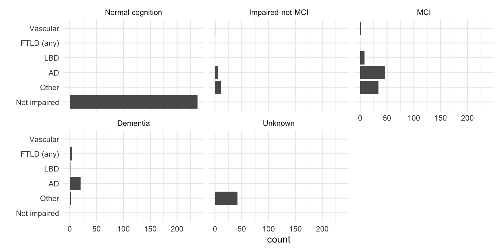

Figure 1: Number of CLARiTI pariticpants by etiology and clinical
diagnosis.

Code

``` r

Etiology_levs <- dd_cross %>% pull(Etiology) %>% 
  table() %>% sort(decreasing = TRUE)

dd_cross %>%
  mutate(Etiology = factor(Etiology, levels = names(Etiology_levs))) %>%
ggplot(aes(y=Etiology, fill = Cohort)) +
  geom_bar() +
  facet_wrap(vars(NACCUDSD)) +
  theme(legend.position = 'inside', legend.position.inside = c(0.8, 0.2)) +
  ylab("")
```

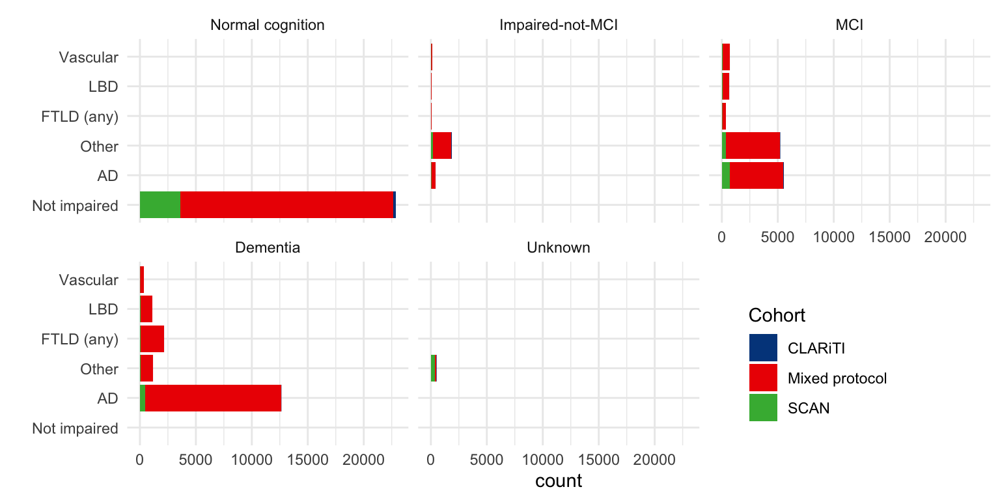

Figure 2: Number of pariticpants including CLARiTI, SCAN, and
mixed-protocol by etiology and clinical diagnosis.

Code

``` r

dd_upset <- dd_cross %>%
  mutate(
    Diagnosis = case_when(!is.na(NACCUDSD) ~ 1, TRUE ~ 0),
    MRI = case_when(!is.na(HIPPOCAMPUS) ~ 1, TRUE ~ 0),
    `Amyloid PET` = case_when(!is.na(CENTILOIDS) ~ 1, TRUE ~ 0),
    `Tau PET` = case_when(!is.na(Tau_PET) ~ 1, TRUE ~ 0)) %>%
  select(NACCID, Cohort, Diagnosis:`Tau PET`) %>%
  as.data.frame()

upset(subset(dd_upset, Cohort == 'CLARiTI'), nsets = 7, nintersects = 30, mb.ratio = c(0.5, 0.5),
      order.by = c("freq", "degree"), decreasing = c(TRUE,FALSE))
```

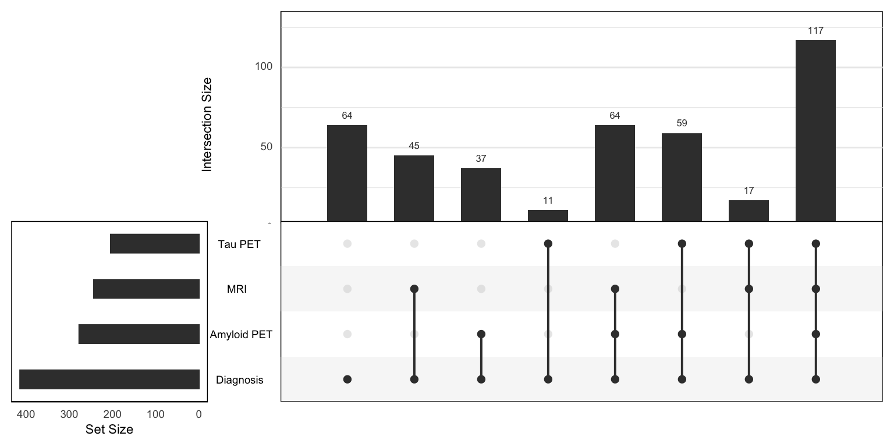

Figure 3: UpSet plot of CLARiTI participants.

Code

``` r

upset(dd_upset, nsets = 7, nintersects = 30, mb.ratio = c(0.5, 0.5),
      order.by = c("freq", "degree"), decreasing = c(TRUE,FALSE))
```

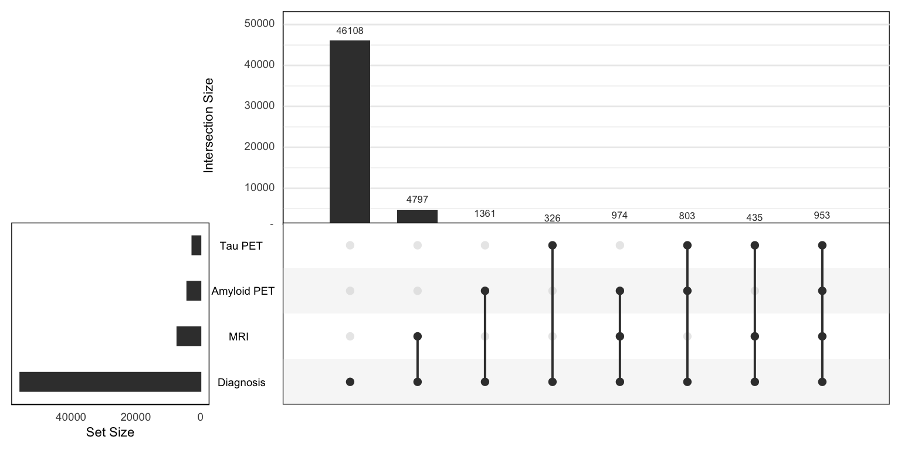

Figure 4: UpSet plot of all participants.

Code

``` r

tmp <- dd %>% 
  select(NACCID, CENTILOIDS, HIPPOCAMPUS, Tau_PET_ComBat) %>%
  rename(
    `Amyloid PET` = CENTILOIDS, `Volumetric MRI` = HIPPOCAMPUS, 
    `Tau PET` = Tau_PET_ComBat) %>%
  group_by(NACCID) %>%
  pivot_longer(`Amyloid PET`:`Tau PET`) %>%
  filter(!is.na(value)) %>%
  mutate(Type = factor(name, levels = c(
    "Amyloid PET", "Tau PET", "Volumetric MRI"))) %>%
  group_by(Type, NACCID) %>%
  summarise(`Serial scans` = n())

with(tmp, table(Type, `Serial scans`)) %>% 
  knitr::kable(caption = "Number of individuals who have received the given number serial scans for each scan type.")
```

|                |    1 |    2 |   3 |   4 |   5 |   6 |   7 |   9 |
|:---------------|-----:|-----:|----:|----:|----:|----:|----:|----:|
| Amyloid PET    | 3571 |  475 |  38 |   7 |   0 |   0 |   0 |   0 |
| Tau PET        | 2035 |  274 |  22 |   0 |   0 |   0 |   0 |   0 |
| Volumetric MRI | 5200 | 1315 | 473 | 123 |  25 |  19 |   3 |   1 |

Table 1: Number of individuals who have received the given number serial
scans for each scan type.

Code

``` r

dd %>% 
  select(NACCID, Age, Etiology, NACCUDSD, NACCETPR,
    CENTILOIDS, HIPPOCAMPUS, Tau_PET_ComBat) %>%
  rename(
    `Amyloid PET` = CENTILOIDS, `Volumetric MRI` = HIPPOCAMPUS, 
    `Tau PET` = Tau_PET_ComBat) %>%
  pivot_longer(`Amyloid PET`:`Tau PET`) %>%
  filter(!is.na(value), !is.na(Age), !is.na(NACCUDSD)) %>%
  mutate(Type = factor(name, levels = c(
    "Amyloid PET", "Tau PET", "Volumetric MRI"))) %>%
  group_by(NACCID, Type) %>%
  mutate(
    Age0 = min(Age, na.rm = TRUE),
    `Initial Dx` = case_when(
      Age == Age0 ~ NACCUDSD,
      TRUE ~ NA),
    Years = Age - Age0) %>%
  arrange(NACCID, Years) %>%
  tidyr::fill(all_of("Initial Dx"), .direction = "down") %>%
  group_by(Type, Years) %>%
  summarise(count = n()) %>%
  mutate(`Cumulative count` = cumsum(count)) %>%
ggplot(aes(x=Years, y=`Cumulative count`, color = Type)) +
  geom_line() +
  xlab('Years from first scan of each type')
```

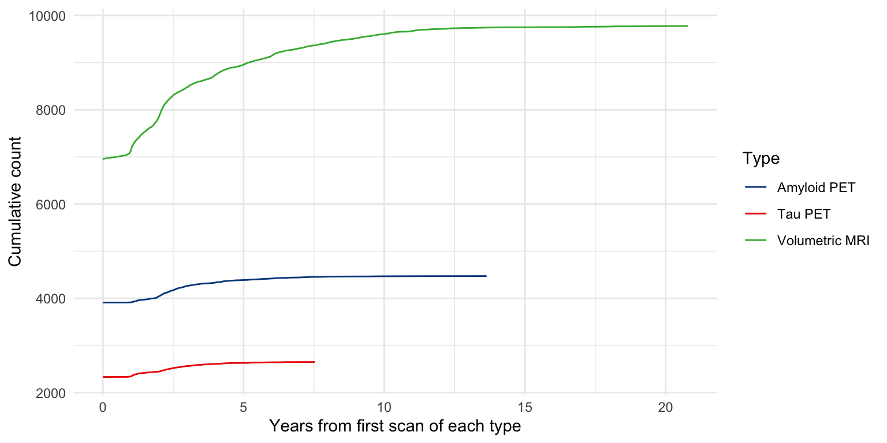

Figure 5: Cumulative scans by time from first scan of each scan type.

## Baseline characteristics

### CLARiTI participants

Code

``` r

tbl_summary(
  data = dd_cross %>% filter(Cohort == 'CLARiTI'),
  by = NACCUDSD,
  include = c("Etiology", "SEX", "Age", "RACE", "HISPANIC", "AMYLOID_STATUS", "CENTILOIDS", "HIPPOCAMPUS", "Tau_PET", "Tau_TRACER", "PHC_MEM", "PHC_EXF", "PHC_LAN", "EDUC"),
  type = all_continuous() ~ "continuous2",
  statistic = list(
    all_continuous() ~ c(
      "{mean} ({sd})",
      "{median} ({p25}, {p75})",
      "{min}, {max}"),
    all_categorical() ~ "{n} ({p}%)"),
  digits = all_continuous() ~ 1,
  percent = "row",
  missing_text = "(Missing)") %>%
  add_stat_label(label = all_continuous2() ~ c("Mean (SD)", "Median (Q1, Q3)", "Range")) %>%
  # add_overall() %>%
  modify_caption(caption = "Characteristics of CLARiTI participants by baseline diagnosis. Note CLARiTI participants are those with a NACCID in clariti_edc or any of the CLARiTI imaging summary files.") %>%
  modify_footnote_header(
    footnote = "Row-wise percentage; n (%)",
    columns = all_stat_cols(),
    replace = TRUE) %>%
  # modify_abbreviation(abbreviation = abbrev_list) %>%
  bold_labels()
```

[TABLE]

Table 2: Characteristics of CLARiTI participants by baseline diagnosis.
Note CLARiTI participants are those with a NACCID in clariti_edc or any
of the CLARiTI imaging summary files.

### All participants

Code

``` r

tbl_summary(
  data = dd_cross,
  by = NACCUDSD,
  include = c("Etiology", "SEX", "Age", "RACE", "HISPANIC", "AMYLOID_STATUS", "CENTILOIDS", "HIPPOCAMPUS", "Tau_PET", "Tau_TRACER", "PHC_MEM", "PHC_EXF", "PHC_LAN", "EDUC"),
  type = all_continuous() ~ "continuous2",
  statistic = list(
    all_continuous() ~ c(
      "{mean} ({sd})",
      "{median} ({p25}, {p75})",
      "{min}, {max}"
    ),
    all_categorical() ~ "{n} ({p}%)"
  ),
  digits = all_continuous() ~ 1,
  percent = "row",
  missing_text = "(Missing)"
) %>%
  add_stat_label(label = all_continuous2() ~ c("Mean (SD)", "Median (Q1, Q3)", "Range")) %>%
  modify_caption(caption = "Characteristics of all participants by baseline diagnosis.") %>%
  modify_footnote_header(
    footnote = "Row-wise percentage; n (%)",
    columns = all_stat_cols(),
    replace = TRUE
  ) %>%
  # modify_abbreviation(abbreviation = abbrev_list) %>%
  bold_labels()
```

[TABLE]

Table 3: Characteristics of all participants by baseline diagnosis.

### Participants with hippocampal volumes

Code

``` r

tbl_summary(
  data = dd_cross %>% filter(!is.na(HIPPOCAMPUS)),
  by = NACCUDSD,
  include = c("Etiology", "SEX", "Age", "RACE", "HISPANIC", "AMYLOID_STATUS", "CENTILOIDS", "HIPPOCAMPUS", "Tau_PET", "Tau_TRACER", "PHC_MEM", "PHC_EXF", "PHC_LAN", "EDUC"),
  type = all_continuous() ~ "continuous2",
  statistic = list(
    all_continuous() ~ c(
      "{mean} ({sd})",
      "{median} ({p25}, {p75})",
      "{min}, {max}"
    ),
    all_categorical() ~ "{n} ({p}%)"
  ),
  digits = all_continuous() ~ 1,
  percent = "row",
  missing_text = "(Missing)"
) %>%
  add_stat_label(label = all_continuous2() ~ c("Mean (SD)", "Median (Q1, Q3)", "Range")) %>%
  modify_caption(caption = "Characteristics of all participants with MRI data by baseline diagnosis.") %>%
  modify_footnote_header(
    footnote = "Row-wise percentage; n (%)",
    columns = all_stat_cols(),
    replace = TRUE
  ) %>%
  # modify_abbreviation(abbreviation = abbrev_list) %>%
  bold_labels()
```

[TABLE]

Table 4: Characteristics of all participants with MRI data by baseline
diagnosis.

### Participants with tau PET

Code

``` r

tbl_summary(
  data = dd_cross %>% filter(!is.na(Tau_PET)),
  by = NACCUDSD,
  include = c("Etiology", "SEX", "Age", "RACE", "HISPANIC", "AMYLOID_STATUS", "CENTILOIDS", "HIPPOCAMPUS", "Tau_PET", "Tau_TRACER", "PHC_MEM", "PHC_EXF", "PHC_LAN", "EDUC"),
  type = all_continuous() ~ "continuous2",
  statistic = list(
    all_continuous() ~ c(
      "{mean} ({sd})",
      "{median} ({p25}, {p75})",
      "{min}, {max}"
    ),
    all_categorical() ~ "{n} ({p}%)"
  ),
  digits = all_continuous() ~ 1,
  percent = "row",
  missing_text = "(Missing)"
) %>%
  add_stat_label(label = all_continuous2() ~ c("Mean (SD)", "Median (Q1, Q3)", "Range")) %>%
  modify_caption(caption = "Characteristics of all participants with tau PET data by baseline diagnosis.") %>%
  modify_footnote_header(
    footnote = "Row-wise percentage; n (%)",
    columns = all_stat_cols(),
    replace = TRUE
  ) %>%
  # modify_abbreviation(abbreviation = abbrev_list) %>%
  bold_labels()
```

[TABLE]

Table 5: Characteristics of all participants with tau PET data by
baseline diagnosis.

### Participants with amyloid PET

Code

``` r

tbl_summary(
  data = dd_cross %>% filter(!is.na(CENTILOIDS)),
  by = NACCUDSD,
  include = c("Etiology", "SEX", "Age", "RACE", "HISPANIC", "AMYLOID_STATUS", "CENTILOIDS", "HIPPOCAMPUS", "Tau_PET", "Tau_TRACER", "PHC_MEM", "PHC_EXF", "PHC_LAN", "EDUC"),
  type = all_continuous() ~ "continuous2",
  statistic = list(
    all_continuous() ~ c(
      "{mean} ({sd})",
      "{median} ({p25}, {p75})",
      "{min}, {max}"
    ),
    all_categorical() ~ "{n} ({p}%)"
  ),
  digits = all_continuous() ~ 1,
  percent = "row",
  missing_text = "(Missing)"
) %>%
  add_stat_label(label = all_continuous2() ~ c("Mean (SD)", "Median (Q1, Q3)", "Range")) %>%
  modify_caption(caption = "Characteristics of NACC ADRC participants with amyloid PET data by baseline diagnosis.") %>%
  modify_footnote_header(
    footnote = "Row-wise percentage; n (%)",
    columns = all_stat_cols(),
    replace = TRUE
  ) %>%
  # modify_abbreviation(abbreviation = abbrev_list) %>%
  bold_labels()
```

[TABLE]

Table 6: Characteristics of NACC ADRC participants with amyloid PET data
by baseline diagnosis.

## Summary plots

### Spaghetti plots

Code

``` r


dd %>% 
  select(NACCID, SOURCE = Amyloid_SOURCE, Etiology, Age, NACCUDSD, NACCETPR, CENTILOIDS) %>%
  filter(!is.na(CENTILOIDS), !is.na(Age)) %>%
  group_by(NACCID) %>%
  mutate(
    Age0 = min(Age),
    `Initial Dx` = case_when(
      Age == Age0 ~ NACCUDSD,
      TRUE ~ NA),
    Years = Age - Age0) %>%
  arrange(NACCID, Years) %>%
  tidyr::fill(all_of("Initial Dx"), .direction = "down") %>%
ggplot(aes(x=Years, y=CENTILOIDS)) +
  geom_point(aes(color=SOURCE, shape = Etiology), alpha=1) +
  geom_line(aes(group = NACCID), alpha=0.1) +
  facet_grid(. ~ `Initial Dx`) +
  guides(colour = guide_legend(override.aes = list(alpha=1))) +
  ylab('Amyloid PET (CL)')
```

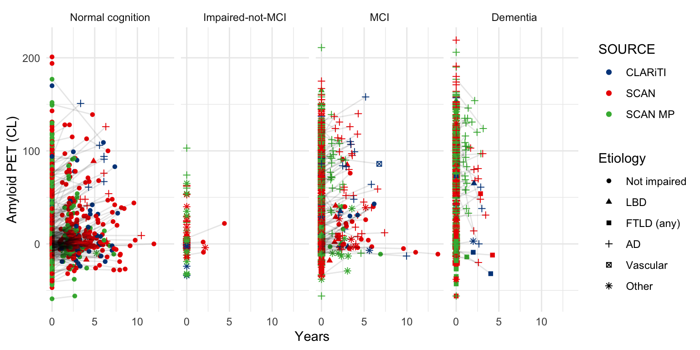

Spaghetti plot of amyloid PET.

Code

``` r

dd %>% 
  select(NACCID, SOURCE = Tau_SOURCE, Etiology, Age, NACCUDSD, NACCETPR, Tau_PET_ComBat) %>%
  filter(!is.na(Tau_PET_ComBat), !is.na(Age)) %>%
  group_by(NACCID) %>%
  mutate(
    Age0 = min(Age),
    `Initial Dx` = case_when(
      Age == Age0 ~ NACCUDSD,
      TRUE ~ NA),
    Years = Age - Age0) %>%
  arrange(NACCID, Years) %>%
  tidyr::fill(all_of("Initial Dx"), .direction = "down") %>%
ggplot(aes(x=Years, y=Tau_PET_ComBat)) +
  geom_point(aes(color=SOURCE, shape = Etiology), alpha=1) +
  geom_line(aes(group = NACCID), alpha=0.1) +
  facet_grid(. ~ `Initial Dx`) +
  guides(colour = guide_legend(override.aes = list(alpha=1))) +
  ylab('Tau PET (MTL SUVR)')
```

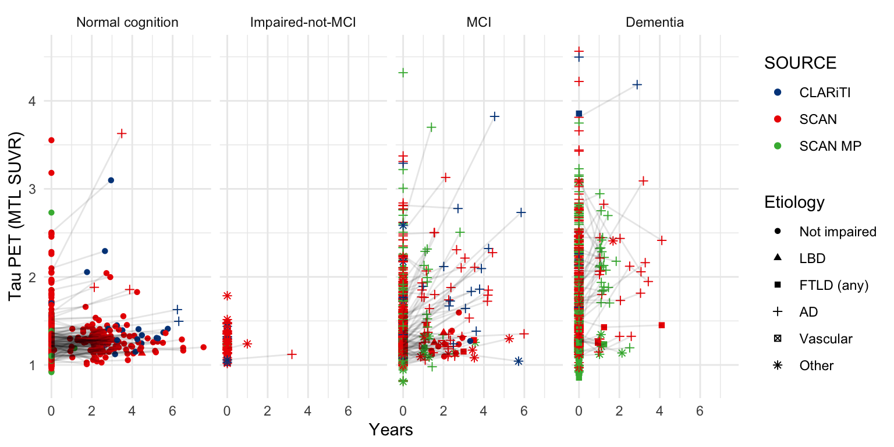

Spaghetti plot of tau PET.

Code

``` r

dd %>% 
  select(NACCID, SOURCE = MRI_SOURCE, Etiology, Age, NACCUDSD, NACCETPR, HIPPOCAMPUS) %>%
  filter(!is.na(HIPPOCAMPUS), !is.na(Age)) %>%
  group_by(NACCID) %>%
  mutate(
    Age0 = min(Age),
    `Initial Dx` = case_when(
      Age == Age0 ~ NACCUDSD,
      TRUE ~ NA),
    Years = Age - Age0) %>%
  arrange(NACCID, Years) %>%
  tidyr::fill(all_of("Initial Dx"), .direction = "down") %>%
ggplot(aes(x=Years, y=HIPPOCAMPUS)) +
  geom_point(aes(color=SOURCE, shape = Etiology), alpha=1) +
  geom_line(aes(group = NACCID), alpha=0.1) +
  facet_grid(. ~ `Initial Dx`) +
  guides(colour = guide_legend(override.aes = list(alpha=1))) +
  ylab('Hippocampal volume')
```

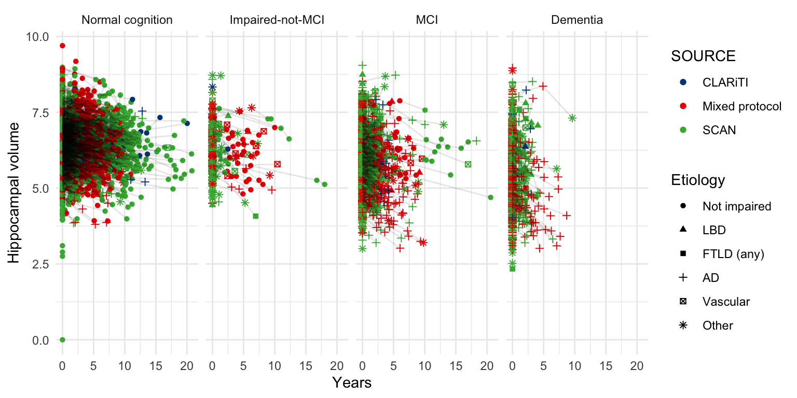

Spaghetti plot of hippocampal volumes.

Code

``` r

dd %>% 
  select(NACCID, Age, Etiology, NACCUDSD, NACCETPR,
    PHC_MEM, PHC_EXF, PHC_LAN) %>%
  rename(Memory = PHC_MEM, `Exec. Function` = PHC_EXF, Language = PHC_LAN) %>%
  group_by(NACCID) %>%
  mutate(
    Age0 = min(Age),
    `Initial Dx` = case_when(
      Age == Age0 ~ NACCUDSD,
      TRUE ~ NA),
    Years = Age - Age0) %>%
  arrange(NACCID, Years) %>%
  tidyr::fill(all_of("Initial Dx"), .direction = "down") %>%
  pivot_longer(Memory:Language) %>%
  filter(!is.na(value), !is.na(Years), !is.na(NACCUDSD)) %>%
ggplot(aes(x=Years, y=value)) +
  geom_point(aes(color = Etiology), alpha=0.1) +
  facet_grid(name ~ `Initial Dx`, scales = 'free_y') +
  guides(colour = guide_legend(override.aes = list(alpha=1))) +
  ylab('')
```

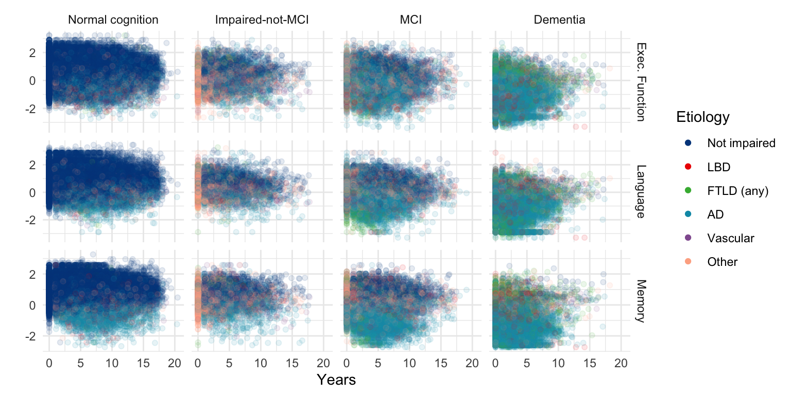

Spaghetti plot of harmonized cognitive scores.

### LOESS Trends

Code

``` r

dd %>% 
  select(NACCID, Age, Etiology, NACCUDSD, NACCETPR,
    CENTILOIDS, HIPPOCAMPUS, Tau_PET_ComBat, PHC_MEM, PHC_EXF, PHC_LAN) %>%
  rename(
    `Amyloid PET (CL)` = CENTILOIDS, `Hipp. volume` = HIPPOCAMPUS, 
    `Tau PET (MTL SUVR)` = Tau_PET_ComBat,
    Memory = PHC_MEM, `Exec. Function` = PHC_EXF, Language = PHC_LAN) %>%
  group_by(NACCID) %>%
  mutate(
    Age0 = min(Age),
    `Initial Dx` = case_when(
      Age == Age0 ~ NACCUDSD,
      TRUE ~ NA),
    Years = Age - Age0) %>%
  arrange(NACCID, Years) %>%
  tidyr::fill(all_of("Initial Dx"), .direction = "down") %>%
  pivot_longer(`Amyloid PET (CL)`:Language) %>%
  filter(!is.na(value), !is.na(Years), !is.na(NACCUDSD)) %>%
  mutate(name = factor(name, levels = c(
    "Amyloid PET (CL)", "Tau PET (MTL SUVR)", "Hipp. volume", 
    "Memory", "Exec. Function", "Language"))) %>%
ggplot(aes(x=Age, y=value, color = `Initial Dx`)) +
  facet_wrap(vars(name), scales = 'free_y', ncol = 2) +
  geom_smooth(method = 'gam', formula = y ~ s(x, bs = "cs", fx = TRUE, k = 1)) +
  ylab('Amyloid PET (CL)')
```

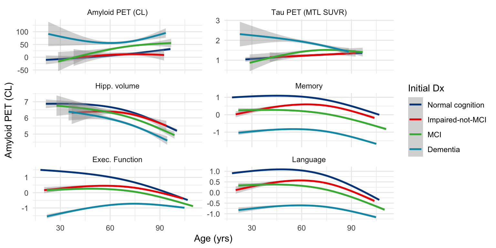

LOESS plots.

### ComBat Harmonization of tau PET (tracers)

Code

``` r

summary(tau_PET_fit)
#> Linear mixed-effects model fit by REML
#>   Data: tmp 
#>    AIC  BIC logLik
#>   2126 2168  -1056
#> 
#> Random effects:
#>  Formula: ~1 | NACCID
#>         (Intercept) Residual
#> StdDev:        0.37     0.24
#> 
#> Variance function:
#>  Structure: Different standard deviations per stratum
#>  Formula: ~1 | Tau_TRACER 
#>  Parameter estimates:
#>       MK6240 Flortaucipir 
#>         1.00         0.33 
#> Fixed effects:  Tau_PET ~ Tau_TRACER + SEX + Age 
#>                  Value Std.Error   DF t-value p-value
#> (Intercept)       1.42     0.063 2329    22.7    0.00
#> Tau_TRACERMK6240 -0.12     0.019  316    -6.5    0.00
#> SEXFemale         0.00     0.017 2329    -0.1    0.95
#> Age               0.00     0.001  316    -0.4    0.71
#>  Correlation: 
#>                  (Intr) T_TRAC SEXFml
#> Tau_TRACERMK6240 -0.108              
#> SEXFemale        -0.160 -0.059       
#> Age              -0.978  0.054  0.011
#> 
#> Standardized Within-Group Residuals:
#>    Min     Q1    Med     Q3    Max 
#> -2.426 -0.145 -0.082  0.021  6.870 
#> 
#> Number of Observations: 2649
#> Number of Groups: 2331
ggplot(dd %>% filter(!is.na(Tau_PET_ComBat)), 
  aes(x = Tau_PET, y = Tau_PET_ComBat, color = Tau_TRACER)) +
  geom_point() +
  geom_abline(intercept = 0, slope = 1, linetype = 'dashed')
```

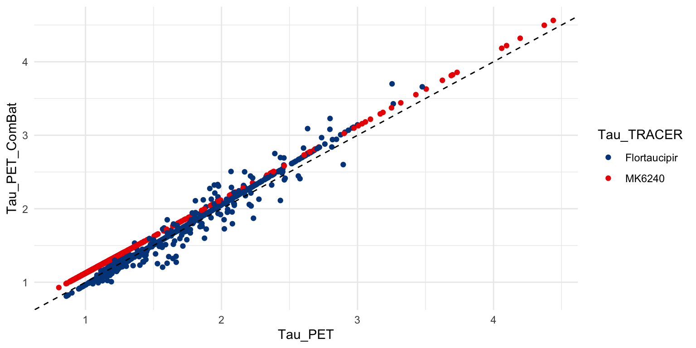

ComBat transformed versus raw Tau PET data by tracer.

### Publishing with NACC Data

Authors must comply with the [NACC data use
agreement](https://www.naccdata.org/requesting-data/dua). See the
[author
checklist](https://www.naccdata.org/about-nacc-data/publish-with-nacc-data/)
for more information. If you use the `NACCADRC` R data package, please
also cite ([Donohue et al. 2026](#ref-donohue2026alzheimer)).

### Funding

Work on this `R` package was funded by CLARiTI (NIH U01 AG082350). The
NACC database is funded by NIA/NIH Grant U24 AG072122. SCAN was funded
by NIA/NIH U24 AG067418. For funding of clinical sites, see [NACC data
use agreement](https://www.naccdata.org/requesting-data/dua), also
copied
[here](https://atri-biostats.github.io/NACCADRC/articles/%22../articles/NACCADRC-Publishing-with-NACCADRC-Data.html%22).

### References

Donohue, Michael C, Kedir Hussen, Oliver Langford, Richard Gallardo,
Gustavo Jimenez-Maggiora, Paul S Aisen, and Alzheimer’s Disease
Neuroimaging Initiative. 2026. “Alzheimer’s clinical research data via R
packages: The alzverse.” *Alzheimer’s & Dementia* 22 (2): e71152.
<https://doi.org/10.1002/alz.71152>.
