# NACCADRC Basic Summaries

## Merge key imaging and PHC cognitive data

Code

``` r

library(NACCADRC)
library(ggplot2)
library(tidyverse)
library(nlme)
library(data.table)
library(gtsummary)
library(UpSetR)
library(patchwork)
library(sva)

data(mrisbm, taupetnpdka, phc_cognition, amyloidpetgaain,
uds_ftldlbd, clariti_edc, uds_version, data_release_date)

# set coded missing values (e.g. -4 = Not available, 9999 = Unknown) to NA
uds_ftldlbd <- nacc_na(uds_ftldlbd)

theme_set(theme_minimal())

scale_colour_discrete <-
  function(...) ggsci::scale_color_jama()
scale_fill_discrete <-
  function(...) ggsci::scale_fill_jama()

cohort_color <- c(CLARITI = "#C02126", CLARiTI = "#C02126",
  SCAN = "#173058",
  "Mixed protocol" = "#42B540FF", "SCAN MP" = "#42B540FF",
  PENDING = "#80796BFF")
```

Code

``` r

## Combine hippocampal volume from SCAN and Mixed Protocol (UDS) ----
# mrisbm keeps each source's names: legacy mixed protocol rows (SCAN MP,
# DeCarli lab) have HIPPOVOL and NACCICV; SCAN/CLARiTI rows have HIPPOCAMPUS
# and ESTIMATEDTOTALINTRACRANIALVOL (mm3). All volumes here are in cm3.
mri_hipp <- mrisbm %>%
  mutate(
    HIPPOCAMPUS = if_else(PROJECT == "SCAN MP", HIPPOVOL, HIPPOCAMPUS),
    ICV = if_else(PROJECT == "SCAN MP", NACCICV,
      ESTIMATEDTOTALINTRACRANIALVOL / 1000),
    # implausible volumes (< 1.5 cm3) set to NA: in release 75, a SCAN scan
    # with HIPPOCAMPUS = 0 (left/right volumes look normal) and a legacy scan
    # with HIPPOVOL = 0.96 (whole-brain volume also 30% below later scans)
    HIPPOCAMPUS = if_else(HIPPOCAMPUS < 1.5, NA_real_, HIPPOCAMPUS)) %>%
  select(PROJECT, NACCID, DATE = SCANDT, HIPPOCAMPUS, ICV) %>%
  distinct(NACCID, DATE, .keep_all = TRUE)

NACCETPR_levels <- names(rev(sort(table(uds_ftldlbd$NACCETPR))))

# UDS cognitive status, keeping the UDS v4 behavioral-only category
recode_udsd <- function(NACCUDSD) {
  case_when(
    is.na(NACCUDSD) ~ 'Unknown',
    NACCUDSD == "No cognitive impairment, only behavioral impairment" ~
      "Behavioral impairment only",            # UDS v4
    TRUE ~ as.character(NACCUDSD)) %>%
    factor(levels = c("Normal cognition", "Behavioral impairment only",
      "Impaired-not-MCI", "MCI", "Dementia", 'Unknown'))
}

# Simplified (collapsed) etiological diagnosis
make_etiology <- function(NACCETPR, NACCLBDS) {
  case_when(
    NACCETPR == "Alzheimer's disease (AD)" ~ 'AD',
    # NACCLBDS = 1: Lewy body syndrome among impaired participants
    NACCETPR == 'Lewy body disease (LBD)' | NACCLBDS == 1 ~ 'LBD',
    NACCETPR %in% c("FTLD, other", "FTLD with motor neuron disease (e.g., ALS)") ~
      "FTLD (any)",
    NACCETPR == "Vascular brain injury or vascular dementia including stroke" ~ "Vascular",
    NACCETPR == 'Not applicable, not cognitively impaired' ~ 'Not impaired',
    TRUE ~ 'Other') %>%
    factor(levels = c('Not impaired', 'LBD', "FTLD (any)", 'AD', "Vascular", 'Other'))
}

## Combine hipp volume, tau PET, amyloid PET, cognition, and demographics ----
dd_atn <- clariti_edc %>%
  select(NACCID) %>% distinct() %>% mutate(`CLARiTI EDC` = 'Yes') %>%
  full_join(mri_hipp %>%                 # Hippocampal volumes
      select(NACCID, MRI_PROJECT = PROJECT, DATE, HIPPOCAMPUS, ICV),
    by = 'NACCID') %>%
  full_join(taupetnpdka %>%
      arrange(NACCID, SCANDATE, desc(PROCESSDATE)) %>%
      distinct(NACCID, SCANDATE, .keep_all = TRUE) %>%
      select(NACCID, DATE = SCANDATE, Tau_PET = METATEMPORALSUVR,
        Tau_TRACER = TRACER, Tau_PROJECT = PROJECT) %>%
      distinct(NACCID, DATE, .keep_all = TRUE),
    by = c('NACCID', 'DATE')) %>%
  full_join(amyloidpetgaain %>%          # Amyloid PET
      arrange(NACCID, SCANDATE, desc(PROCESSDATE)) %>%
      distinct(NACCID, SCANDATE, .keep_all = TRUE) %>%
      select(NACCID, DATE = SCANDATE, AMYLOID_STATUS = AMYLOIDSTATUS, CENTILOIDS,
        Amyloid_TRACER = TRACER, Amyloid_PROJECT = PROJECT) %>%
      distinct(NACCID, DATE, .keep_all = TRUE),
    by = c('NACCID', 'DATE')) %>%
  full_join(phc_cognition %>%            # Harmonized cognition
      select(NACCID, NACCVNUM, PHC_MEM, PHC_EXF, PHC_LAN) %>%
      distinct(NACCID, NACCVNUM, .keep_all = TRUE) %>%
      left_join(uds_ftldlbd %>%          # UDS visit dates
          select(NACCID, NACCVNUM, DATE = VISITDATE),
        by = c('NACCID', 'NACCVNUM')) %>%
      distinct(NACCID, DATE, .keep_all = TRUE),
    by = c('NACCID', 'DATE'))

stopifnot(with(dd_atn, !any(duplicated(paste(NACCID, DATE)))))

dd <- dd_atn %>%
  full_join(uds_ftldlbd %>%              # UDS diagnosis, etiology over time
      filter(NACCID %in% c(dd_atn$NACCID, clariti_edc$NACCID)) %>%
      mutate(
        NACCETPR = factor(NACCETPR, levels = NACCETPR_levels)) %>%
      # NACCLBDS (Lewy body syndrome, UDS v1-v4) replaces PARK (UDS v3 only)
      select(NACCID, DATE = VISITDATE, NACCUDSD, NACCETPR, NACCLBDS) %>%
      distinct(NACCID, DATE, .keep_all = TRUE),
    by = c('NACCID', 'DATE')) %>%
  left_join(uds_ftldlbd %>%              # UDS demographics
      filter(!is.na(BIRTHDATE)) %>%          # BIRTHYR, BIRTHMO, day 15
      arrange(NACCID, NACCVNUM) %>%
      select(NACCID, BIRTHDATE, RACE, SEX = NACCSEX, EDUC, HISPANIC = NACCHISP) %>%
      group_by(NACCID) %>%               # Carry information back/forward
      tidyr::fill(.direction = "updown") %>% # to impute missing data
      ungroup() %>%
      filter(!duplicated(NACCID)),       # One row of demographics per NACCID
    by = 'NACCID') %>%
  arrange(NACCID, DATE) %>%
  group_by(NACCID) %>%                   # Carry Dx information forward/back
  tidyr::fill(all_of(c("NACCUDSD", "NACCETPR", "NACCLBDS")), .direction = "downup") %>%
  mutate(ICV = mean(ICV, na.rm = TRUE)) %>% # Average ICV over visits
  ungroup() %>%
  mutate(
    Age = as.numeric(DATE - BIRTHDATE)/365.25,
    Etiology = make_etiology(NACCETPR, NACCLBDS),
    NACCUDSD = recode_udsd(NACCUDSD))

stopifnot(with(dd, !any(duplicated(paste(NACCID, DATE)))))

CLARiTI_id <- dd %>%
  filter(grepl("CLARITI", MRI_PROJECT) | grepl("CLARITI", Tau_PROJECT) |
    grepl("CLARITI", Amyloid_PROJECT)) %>%
  pull(NACCID) %>% unique()

SCAN_id <- dd %>%
  filter(MRI_PROJECT == 'SCAN' | Tau_PROJECT == 'SCAN' | Amyloid_PROJECT == 'SCAN') %>%
  pull(NACCID) %>% unique() %>%
  setdiff(CLARiTI_id)

Mixed_id <- dd %>%
  filter(MRI_PROJECT == 'SCAN MP' | Tau_PROJECT == 'SCAN MP' | Amyloid_PROJECT == 'SCAN MP') %>%
  pull(NACCID) %>% unique() %>%
  setdiff(c(CLARiTI_id, SCAN_id))

# participants with SCAN-protocol (SCAN or CLARiTI) MRI; legacy mixed protocol
# MRI does not count toward CLARiTI "complete data"
scan_mri_id <- dd %>%
  filter(!is.na(HIPPOCAMPUS), MRI_PROJECT != 'SCAN MP') %>%
  pull(NACCID) %>% unique()

# harmonize tau PET data ----
tmp <- dd %>% filter(!is.na(Tau_PET) & !is.na(Age)) %>%
  mutate(across(where(is.factor), fct_drop))
set.seed(42)
tmp$Tau_PET_ComBat <- sva::ComBat(
  dat=rbind(tmp$Tau_PET, jitter(tmp$Tau_PET)), # ComBat needs two rows
  batch=tmp$Tau_TRACER,
  mod=model.matrix(~Age + SEX, tmp), par.prior=TRUE, prior.plots=FALSE)[1,]

dd <- dd %>%
  left_join(tmp %>% select(NACCID, DATE, Tau_PET_ComBat),
    by = c('NACCID', 'DATE'))

## CLARiTI visit and the UDS visit closest to it ----
# CLARiTI visit: first consent date (CNSTDT1), or screening date (SCREENDT)
# when CNSTDT1 is not available (-4)
first_date <- function(x) {
  x <- as.IDate(x, format = "%Y-%m-%d")
  if (all(is.na(x))) x[NA_integer_][1] else min(x, na.rm = TRUE)
}
clariti_visit <- clariti_edc %>%
  group_by(NACCID) %>%
  summarise(CLARITI_DATE = coalesce(first_date(CNSTDT1), first_date(SCREENDT)))

clariti_uds <- uds_ftldlbd %>%
  filter(NACCID %in% clariti_visit$NACCID) %>%
  select(NACCID, VISITDATE, BIRTHDATE, FORMVER, PACKET, NACCUDSD, NACCETPR,
    NACCLBDS, NACCSEX, EDUC, NACCEDULVL, NACCNIHR, NACCHISP, SCD, MBI,
    TRTBIOMARK, BIOMARKDX) %>%
  inner_join(clariti_visit, by = "NACCID") %>%
  mutate(Delay = as.numeric(VISITDATE - CLARITI_DATE)) %>%  # days; < 0: UDS first
  group_by(NACCID) %>%
  slice_min(abs(Delay), n = 1, with_ties = FALSE) %>%
  ungroup() %>%
  mutate(
    Age = as.numeric(VISITDATE - BIRTHDATE)/365.25,    # age at that UDS visit
    NACCETPR = factor(NACCETPR, levels = NACCETPR_levels),
    Etiology = make_etiology(NACCETPR, NACCLBDS),
    NACCUDSD = recode_udsd(NACCUDSD),
    `UDS version` = case_when(
      FORMVER >= 4 ~ "UDS v4",
      FORMVER >= 3 ~ "UDS v3",
      TRUE ~ "UDS v1-2") %>%
      factor(levels = c("UDS v4", "UDS v3", "UDS v1-2")),
    Packet = case_when(
      PACKET %in% c("I", "I4") ~ "Initial visit",
      PACKET == "F" ~ "Follow-up visit",
      PACKET == "IT" ~ "Telephone initial visit",
      PACKET == "T" ~ "Telephone follow-up visit") %>%
      factor(levels = c("Initial visit", "Follow-up visit",
        "Telephone initial visit", "Telephone follow-up visit")))

# x-sectional data ----
# One row per participant: first available value of each variable. For CLARiTI
# participants, diagnosis, etiology, and age are from the UDS visit closest to
# the CLARiTI visit instead.
dd_cross <- dd %>%
  group_by(NACCID) %>%
  fill(everything(), .direction = "updown") %>%
  filter(!duplicated(NACCID)) %>%
  ungroup() %>%
  rows_update(clariti_uds %>%
      select(NACCID, NACCUDSD, NACCETPR, NACCLBDS, Etiology, Age),
    by = "NACCID", unmatched = "ignore") %>%
  mutate(    # add labels for tables
    Cohort = case_when(
      NACCID %in% clariti_edc$NACCID ~ 'CLARiTI',
      NACCID %in% CLARiTI_id ~ 'CLARiTI',
      NACCID %in% SCAN_id ~ 'SCAN',
      NACCID %in% Mixed_id ~ 'Mixed protocol',
      TRUE ~ 'UDS only') %>%
      factor(levels = c('CLARiTI', 'SCAN', 'Mixed protocol', 'UDS only')),
    PHC_MEM = structure(PHC_MEM, label = 'Harmonized Memory'),
    PHC_EXF = structure(PHC_EXF, label = 'Harmonized Exec Function'),
    PHC_LAN = structure(PHC_LAN, label = 'Harmonized Language'),
    EDUC = structure(EDUC, label = 'Education (yrs)'),
    Age = structure(Age, label = 'Age (yrs)'),
    SEX = structure(SEX, label = 'Sex'),
    RACE = structure(RACE, label = 'Race'),
    HISPANIC = structure(HISPANIC, label = 'Hispanic'),
    AMYLOID_STATUS = structure(AMYLOID_STATUS, label = 'Amyloid status'),
    CENTILOIDS = structure(CENTILOIDS, label = 'Amyloid (CL)'),
    HIPPOCAMPUS = structure(HIPPOCAMPUS, label = 'Hippocampal volume (cm3)'),
    Tau_PET = structure(Tau_PET, label = 'Tau PET (SUVR)'),
    Tau_PET_ComBat = structure(Tau_PET_ComBat, label = 'Tau PET (SUVR)'),
    Tau_TRACER = structure(Tau_TRACER, label = 'Tau PET tracer'),
    NACCETPR = structure(NACCETPR, label = 'Primary etiologic diagnosis'),
    NACCUDSD = structure(NACCUDSD, label = 'Cognitive status at UDS visit'))

# data availability indicators for UpSet plots ----
dd_upset <- dd_cross %>%
  mutate(
    `CLARiTI EDC` = case_when(`CLARiTI EDC` == 'Yes' ~ 1, TRUE ~ 0),
    Diagnosis = case_when(!is.na(NACCUDSD) &  NACCUDSD != "Unknown" ~ 1, TRUE ~ 0),
    # CLARiTI participants: SCAN or CLARiTI MRI only, matching "complete
    # data" and the completers (legacy mixed protocol MRI does not count)
    MRI = case_when(
      Cohort == 'CLARiTI' ~ as.numeric(NACCID %in% scan_mri_id),
      !is.na(HIPPOCAMPUS) ~ 1,
      TRUE ~ 0),
    `Amyloid PET` = case_when(!is.na(CENTILOIDS) ~ 1, TRUE ~ 0),
    `Tau PET` = case_when(!is.na(Tau_PET) ~ 1, TRUE ~ 0)) %>%
  select(NACCID, Cohort, `CLARiTI EDC`, Diagnosis:`Tau PET`) %>%
  as.data.frame()
```

Code

``` r

## CLARiTI participant counts ----
clariti_ids <- unique(clariti_edc$NACCID)
clariti_n <- list(
  edc = length(clariti_ids),
  uds = sum(clariti_ids %in% uds_ftldlbd$NACCID),
  imaging = sum(clariti_ids %in% CLARiTI_id),
  imaging_uds = sum(clariti_ids %in% CLARiTI_id & clariti_ids %in% uds_ftldlbd$NACCID),
  complete = dd_upset %>%  # UDS diagnosis, SCAN MRI, amyloid PET, and tau PET
    filter(NACCID %in% clariti_ids, Diagnosis == 1, MRI == 1,
      `Amyloid PET` == 1, `Tau PET` == 1, NACCID %in% scan_mri_id) %>%
    nrow())
clariti_n$pending_uds <- clariti_n$edc - clariti_n$uds
clariti_n$pending_imaging <- clariti_n$edc - clariti_n$imaging
clariti_n$uds_pending_imaging <- clariti_n$uds - clariti_n$imaging_uds
```

Code

``` r

# Flow of CLARiTI EDC participants into UDS and SCAN data ----
plot_clariti_flow <- function(clariti_n, clariti_uds, uds_version) {
  fmt <- function(x) format(x, big.mark = ",")
  n_version <- table(clariti_uds$`UDS version`)
  n_packet <- table(clariti_uds$Packet)
  boxes <- tribble(
    ~x, ~y, ~label, ~main,
    9, 6.3, paste0("CLARiTI EDC: ", fmt(clariti_n$edc), " unique participants\n",
      "investigator_clariti_edc_nacc", uds_version, ".csv"), TRUE,
    9, 4.1, paste0(fmt(clariti_n$uds), " with UDS\n",
      "investigator_ftldlbd_nacc", uds_version, ".csv"), TRUE,
    12, 5.2, paste0(fmt(clariti_n$pending_uds), " pending UDS"), FALSE,
    12, 3.0, paste0(fmt(clariti_n$uds_pending_imaging), " pending SCAN data"), FALSE,
    9, 1.8, paste0(fmt(clariti_n$imaging_uds), " with SCAN data and UDS\n(",
      fmt(clariti_n$complete), " with complete data)"), TRUE,
    5.4, 4.1, paste(fmt(n_version[n_version > 0]), "with", names(n_version)[n_version > 0],
      collapse = "\n"), FALSE,
    2.0, 4.1, paste(fmt(as.numeric(n_packet)), tolower(names(n_packet)), collapse = "\n"), FALSE)
  arrows <- tribble(
    ~x, ~y, ~xend, ~yend,
    9, 5.75, 9, 4.65,       # EDC -> UDS
    9, 5.2, 10.95, 5.2,     # -> pending UDS
    9, 3.55, 9, 2.35,       # UDS -> SCAN and UDS
    9, 3.0, 10.75, 3.0,     # -> pending SCAN
    7.3, 4.1, 6.35, 4.1,    # UDS -> version
    4.5, 4.1, 3.55, 4.1)    # version -> packet
  arrow_labels <- tibble(x = c(6.85, 4.05), y = 4.35, label = c("FORMVER", "PACKET"))

  ggplot() +
    geom_segment(data = arrows, aes(x = x, y = y, xend = xend, yend = yend),
      arrow = arrow(length = unit(0.12, "inches"), type = "closed"), color = "gray40") +
    geom_label(data = boxes, aes(x = x, y = y, label = label, color = main),
      size = 3.6, lineheight = 1.1, label.padding = unit(0.5, "lines"),
      label.r = unit(0.1, "lines"), fill = "white") +
    geom_text(data = arrow_labels, aes(x = x, y = y, label = label),
      size = 3.2, fontface = "italic", color = "gray30") +
    scale_color_manual(values = c(`TRUE` = cohort_color[["CLARiTI"]], `FALSE` = "gray40"),
      guide = "none") +
    coord_cartesian(xlim = c(0.3, 13.5), ylim = c(1.2, 6.9), expand = FALSE) +
    theme_void()
}

# Distribution of imaging summaries among CLARiTI participants ----
# complete_only: only CLARiTI EDC participants with UDS diagnosis, MRI, amyloid
# PET, and tau PET ("complete data" in plot_clariti_flow())
clariti_completers <- function(dd_cross) {
  dd_cross %>%
    filter(NACCID %in% clariti_edc$NACCID, NACCUDSD != 'Unknown',
      NACCID %in% scan_mri_id, !is.na(CENTILOIDS), !is.na(Tau_PET))
}

plot_clariti_imaging <- function(dd_cross, complete_only = FALSE) {
  measures <- c("Amyloid (CL)", "Tau PET MTL (SUVR)", "Hippocampal volume (cm3)")
  if (complete_only) dd_cross <- clariti_completers(dd_cross)
  dd_cross %>%
    filter(Cohort == 'CLARiTI') %>%
    filter(NACCUDSD != 'Unknown') %>%
    mutate(
      Diagnosis = case_when(
        NACCUDSD == "Normal cognition" ~ "NC",
        NACCUDSD == "Behavioral impairment only" ~ NA,  # not NC or CI
        NACCETPR == "Alzheimer's disease (AD)" ~ "CI-AD",
        TRUE ~ "CI-nonAD") %>% factor(c("NC", "CI-AD", "CI-nonAD"))) %>%
    filter(!is.na(Diagnosis)) %>%
    select(NACCID, Diagnosis,
      `Amyloid (CL)` = CENTILOIDS,
      `Tau PET MTL (SUVR)` = Tau_PET_ComBat,
      `Hippocampal volume (cm3)` = HIPPOCAMPUS) %>%
    pivot_longer(all_of(measures), names_to = 'Measure', values_to = 'Value') %>%
    filter(!is.na(Value)) %>%
    mutate(Measure = factor(Measure, levels = measures)) %>%  # panel order
  ggplot(aes(x = Diagnosis, y = Value)) +
    geom_violin(fill = "gray80", color = "gray50") +
    ggbeeswarm::geom_beeswarm(color = "blue", alpha = 0.5) +
    facet_wrap(vars(Measure), nrow = 1, scales = 'free', strip.position = "left") +
    labs(x = "", y = "") +
    theme(legend.position = "none", strip.placement = "outside")
}

# Counts by etiology and UDS diagnosis, stacked by cohort ----
# (one row per participant; diagnosis panels with fewer than min_n
# participants are dropped and listed in the caption)
plot_etiology_bars <- function(data, by_cohort = TRUE, min_n = 10) {
  data <- data %>%
    filter(NACCUDSD != 'Unknown') %>%
    mutate(across(where(is.factor), fct_drop))
  n_by_dx <- table(data$NACCUDSD)
  small <- n_by_dx[n_by_dx < min_n]
  caption <- if (length(small)) paste0("Not shown: ",
    paste0(small, ' participants with UDS diagnosis "', names(small), '"', collapse = "; "),
    " (fewer than ", min_n, " per panel)")
  data <- data %>%
    filter(!NACCUDSD %in% names(small)) %>%
    mutate(across(where(is.factor), fct_drop))
  count_data <- data %>%
    group_by(NACCUDSD, Etiology) %>%
    summarise(n = n(), .groups = "drop")
  p <- ggplot(count_data, aes(x = n, y = Etiology))
  p <- if (by_cohort) {
    p + geom_bar(data = data %>% count(NACCUDSD, Etiology, Cohort),
        aes(fill = Cohort), stat = "identity") +
      scale_fill_manual(values = cohort_color)
  } else {
    p + geom_bar(stat = "identity", fill = cohort_color["CLARiTI"])
  }
  p +
    geom_text(aes(label = n), hjust = -0.2, size = 3) +
    expand_limits(x = max(count_data$n) * 1.2) +
    facet_wrap(vars(NACCUDSD)) +
    labs(y = "", x = "Count (N)", caption = caption)
}

# UpSet plot of data availability ----
plot_upset <- function(data) {
  upset(data, nsets = 7, nintersects = 30, mb.ratio = c(0.5, 0.5),
    order.by = c("freq", "degree"), decreasing = c(TRUE, FALSE))
}

# Initial diagnosis: UDS diagnosis at each participant's first observation ----
# Rows without age are dropped first so they cannot make Age0 missing.
add_initial_dx <- function(pd) {
  pd %>%
    filter(!is.na(Age)) %>%
    group_by(NACCID) %>%
    mutate(
      Age0 = min(Age),
      `Initial Dx` = NACCUDSD[which.min(Age)],
      Years = Age - Age0) %>%
    arrange(NACCID, Years)
}

# Drop participants with unknown diagnosis, and diagnosis groups with fewer
# than min_n participants (e.g. "Behavioral impairment only"), from
# longitudinal plots. dx is the grouping column (default: diagnosis at first
# observation). Participants dropped per group are stored in attr(, "dropped")
# for the plot caption.
known_initial_dx <- function(pd, min_n = 10, dx = "Initial Dx",
  dx_label = "initial UDS diagnosis") {
  d <- pd[[dx]]
  unknown <- is.na(d) | d == "Unknown"
  n_by_dx <- tapply(pd$NACCID[!unknown], droplevels(d[!unknown]), n_distinct)
  small <- names(n_by_dx)[n_by_dx < min_n]
  drop <- unknown | d %in% small
  structure(pd[!drop, ] %>% ungroup() %>% mutate(across(all_of(dx), fct_drop)),
    dropped = c(Unknown = n_distinct(pd$NACCID[unknown]), n_by_dx[small]),
    min_n = min_n, dx_label = dx_label)
}

dropped_dx_caption <- function(pd) {
  dropped <- attr(pd, "dropped")
  dropped <- dropped[dropped > 0]
  if (!length(dropped)) return(NULL)
  dx_label <- attr(pd, "dx_label")
  txt <- ifelse(names(dropped) == "Unknown",
    paste(dropped, "participants with unknown", dx_label),
    paste0(dropped, " participants with ", dx_label, ' "', names(dropped),
      '" (fewer than ', attr(pd, "min_n"), " per group)"))
  paste0("Not shown: ", paste(txt, collapse = ";\n"))
}

# Spaghetti plot of a longitudinal measure by initial diagnosis ----
plot_spaghetti <- function(dd, value, project, ylab, alpha = 1) {
  pd <- dd %>%
    select(NACCID, PROJECT = all_of(project), Etiology, Age, NACCUDSD, NACCETPR,
      value = all_of(value)) %>%
    filter(!is.na(value)) %>%
    add_initial_dx() %>%
    known_initial_dx()

  ggplot(pd, aes(x = Years, y = value)) +
    geom_point(aes(color = PROJECT, shape = Etiology), alpha = alpha) +
    geom_line(aes(group = NACCID), alpha = 0.1) +
    geom_density(aes(y = value, x = after_stat(-scaled)),
      color = "darkgray", fill = "gray", alpha = 0.3,
      orientation = "y", inherit.aes = FALSE) +
    scale_x_continuous(labels = function(x) ifelse(x < 0, "", x)) +
    facet_grid(. ~ `Initial Dx`, scales = 'free_x',
      labeller = label_wrap_gen(width = 15)) +
    guides(colour = guide_legend(override.aes = list(alpha = 1))) +
    labs(y = ylab, caption = dropped_dx_caption(pd)) +
    scale_color_manual(values = cohort_color)
}

# Spaghetti plot of CLARiTI participants, time 0 at the CLARiTI visit ----
# Scans before the CLARiTI visit (e.g. earlier SCAN or legacy scans) have
# negative times. Panels are UDS diagnosis at the visit closest to the CLARiTI
# visit.
plot_spaghetti_clariti <- function(dd, value, project, ylab, alpha = 1) {
  pd <- dd %>%
    filter(NACCID %in% clariti_visit$NACCID) %>%
    select(NACCID, DATE, PROJECT = all_of(project), Etiology,
      value = all_of(value)) %>%
    filter(!is.na(value), !is.na(DATE)) %>%
    inner_join(clariti_visit, by = "NACCID") %>%
    left_join(clariti_uds %>% select(NACCID, `CLARiTI Dx` = NACCUDSD),
      by = "NACCID") %>%
    mutate(Years = as.numeric(DATE - CLARITI_DATE) / 365.25) %>%
    known_initial_dx(dx = "CLARiTI Dx",
      dx_label = "diagnosis at CLARiTI visit")

  ggplot(pd, aes(x = Years, y = value)) +
    geom_vline(xintercept = 0, linetype = "dashed", color = "gray50") +
    geom_line(aes(group = NACCID), alpha = 0.1) +
    geom_point(aes(color = PROJECT, shape = Etiology), alpha = alpha) +
    facet_grid(. ~ `CLARiTI Dx`, labeller = label_wrap_gen(width = 15)) +
    guides(colour = guide_legend(override.aes = list(alpha = 1))) +
    labs(x = "Years from CLARiTI visit", y = ylab,
      caption = dropped_dx_caption(pd)) +
    scale_color_manual(values = cohort_color)
}

# LOESS trends of imaging by age and by imputed memory ----
plot_loess <- function(dd) {
  pd1 <- dd %>%
    select(NACCID, Age, Etiology, NACCUDSD, NACCETPR,
      CENTILOIDS, HIPPOCAMPUS, Tau_PET_ComBat) %>%
    rename(
      `Amyloid PET (CL)` = CENTILOIDS, `Hipp. volume` = HIPPOCAMPUS,
      `Tau PET (MTL SUVR)` = Tau_PET_ComBat) %>%
    add_initial_dx() %>%
    pivot_longer(`Amyloid PET (CL)`:`Tau PET (MTL SUVR)`) %>%
    filter(!is.na(value), !is.na(NACCUDSD)) %>%
    mutate(name = factor(name, levels = c(
      "Amyloid PET (CL)", "Tau PET (MTL SUVR)", "Hipp. volume"))) %>%
    known_initial_dx()

  pd2_0 <- dd %>%
    select(NACCID, Age, Memory = PHC_MEM, Etiology, NACCUDSD, NACCETPR,
      CENTILOIDS, HIPPOCAMPUS, Tau_PET_ComBat) %>%
    add_initial_dx() %>%
    mutate(
      Dx0 = `Initial Dx`,
      Memory_int = zoo::na.approx(Memory, na.rm = FALSE)) %>%
    select(NACCID, Age, `Initial Dx`, Dx0, Memory, Memory_int, Etiology,
      NACCUDSD, NACCETPR, CENTILOIDS, HIPPOCAMPUS, Tau_PET_ComBat) %>%
    filter(!is.na(Age), !is.na(Dx0)) %>%
    ungroup()

  # model only initial diagnoses with observed memory scores (e.g. none for
  # "Behavioral impairment only"); others cannot be imputed
  dx_with_memory <- unique(pd2_0$Dx0[!is.na(pd2_0$Memory)])
  pd2_0 <- pd2_0 %>%
    filter(Dx0 %in% dx_with_memory) %>%
    mutate(Dx0 = fct_drop(Dx0))

  fit_mem <- lme(Memory ~ I(Age^3)*Dx0,
    random = ~ Age | NACCID, data = pd2_0, na.action = na.omit)
  pd2_0$Memory_lme <- predict(fit_mem, newdata = pd2_0 %>% select(-Memory)) %>%
    as.numeric()

  pd2 <- pd2_0 %>%
    mutate(
      Memory_i = case_when(
        !is.na(Memory) ~ Memory,
        !is.na(Memory_int) ~ Memory_int,
        !is.na(Memory_lme) ~ Memory_lme)) %>%
    rename(
      `Amyloid PET (CL)` = CENTILOIDS, `Hipp. volume` = HIPPOCAMPUS,
      `Tau PET (MTL SUVR)` = Tau_PET_ComBat) %>%
    pivot_longer(`Amyloid PET (CL)`:`Tau PET (MTL SUVR)`) %>%
    filter(!is.na(value), !is.na(Memory_i), !is.na(NACCUDSD)) %>%
    mutate(name = factor(name, levels = c(
      "Amyloid PET (CL)", "Tau PET (MTL SUVR)", "Hipp. volume"))) %>%
    known_initial_dx()

  p1 <- ggplot(pd1, aes(x=Age, y=value, color = `Initial Dx`)) +
    facet_wrap(vars(name), scales = 'free_y', ncol = 3, strip.position = "left") +
    geom_smooth(method = 'gam', formula = y ~ s(x, bs = "cs", fx = TRUE, k = 1)) +
    coord_cartesian(xlim = c(50, 90)) +
    labs(y = '', caption = dropped_dx_caption(pd1)) +
    theme(strip.placement = "outside")

  p2 <- ggplot(pd2, aes(x=Memory_i, y=value, color = `Initial Dx`)) +
    facet_wrap(vars(name), scales = 'free_y', ncol = 3, strip.position = "left") +
    geom_smooth(method = 'gam',
      formula = y ~ s(x, bs = "cs", k = 2, sp = 1)) +
    coord_cartesian(xlim = c(-1.5, 1.5)) +
    xlab('Harmonized Memory (imputed)') +
    scale_x_reverse() +
    labs(y = '', caption = dropped_dx_caption(pd2)) +
    theme(strip.placement = "outside")

  p1 / p2 + plot_layout(guides = "collect")
}
```

## Summarize data collection

### CLARiTI imaging distributions

Code

``` r

plot_clariti_imaging(dd_cross)
```

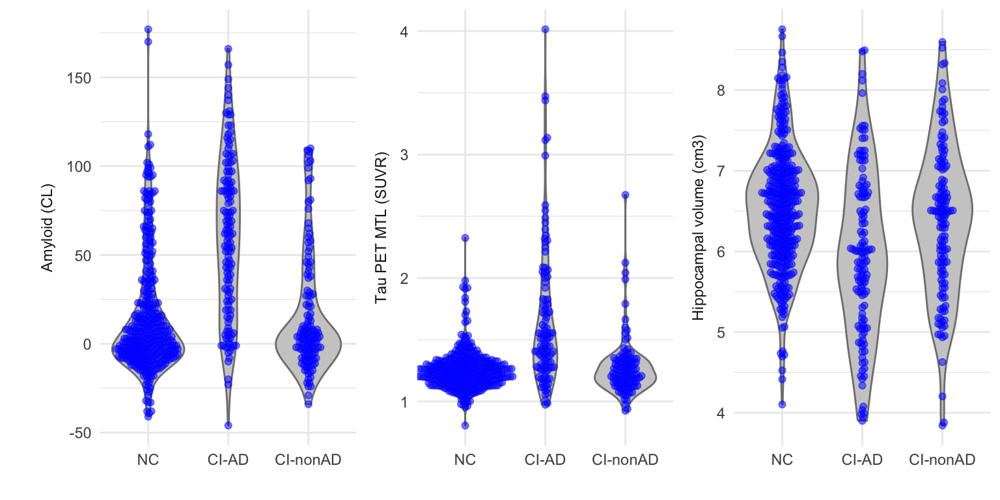

Figure 1: Distribution of imaging summaries among CLARiTI participants
with known UDS cognitive status, amyloid PET (CL), tau PET (SUVR), and
hippocampal volume (cm$`^3`$). Tau PET is shown as SUVR harmonized
across tracers by ComBat.

### Bar charts

Code

``` r

plot_etiology_bars(dd_cross %>% filter(Cohort == 'CLARiTI'), by_cohort = FALSE)
```

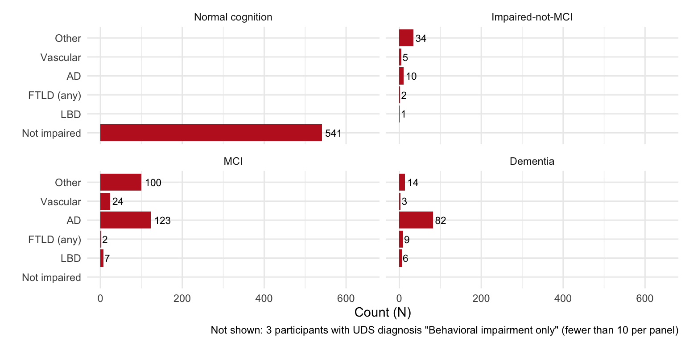

Figure 2: Number of CLARiTI pariticpants by etiology and UDS clinical
diagnosis.

Code

``` r

plot_etiology_bars(dd_cross %>% filter(Cohort != 'UDS only'))
```

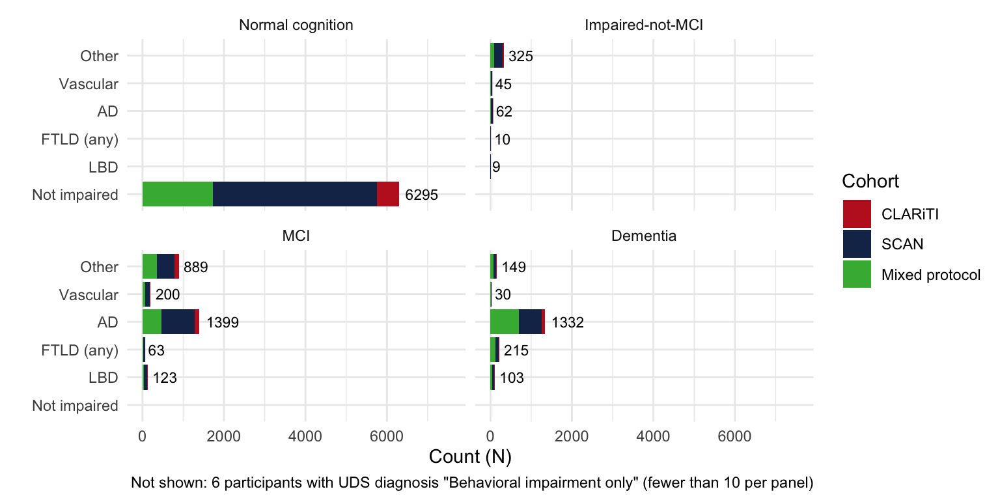

Figure 3: Number of pariticpants with any imaging data including
CLARiTI, SCAN, and mixed-protocol by etiology and UDS clinical
diagnosis.

Code

``` r

plot_etiology_bars(dd_cross %>% filter(!is.na(CENTILOIDS)))
```

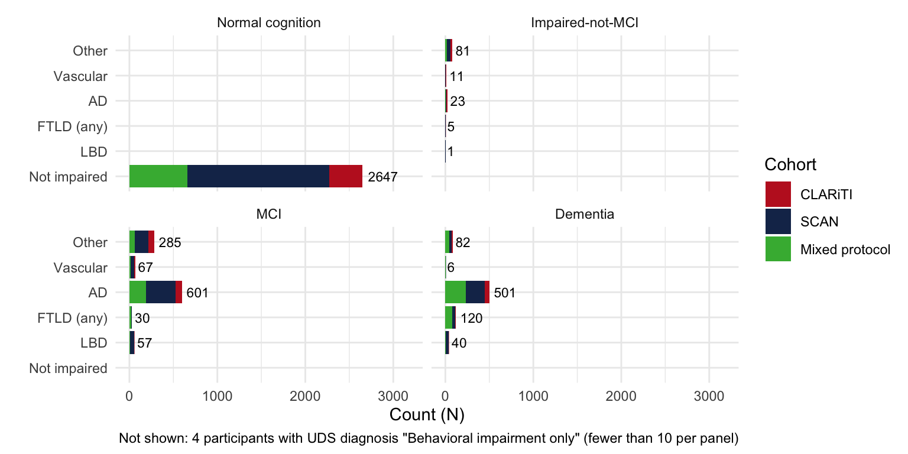

Figure 4: Number of pariticpants with amyloid PET, including CLARiTI,
SCAN, and mixed-protocol by etiology and UDS clinical diagnosis.

Code

``` r

plot_etiology_bars(dd_cross %>% filter(!is.na(Tau_PET)))
```

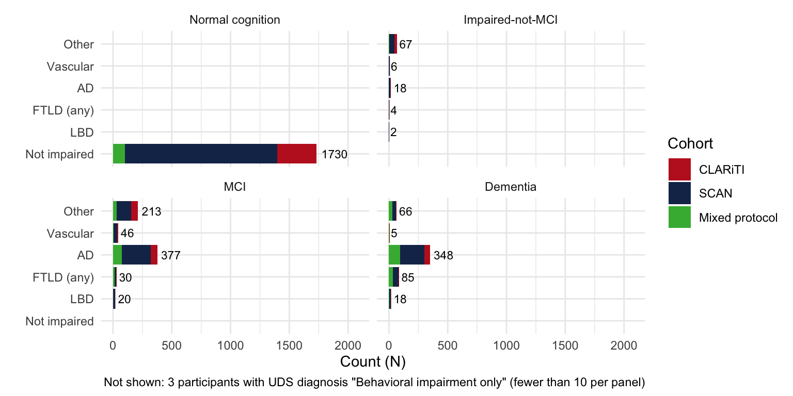

Figure 5: Number of pariticpants with tau PET, including CLARiTI, SCAN,
and mixed-protocol by etiology and UDS clinical diagnosis.

### UpSet plots

Code

``` r

# Output list CLARiTI participants with missing data for QC ----
if(FALSE){
  qc_dir <- file.path('..', 'reports', 'qc')
  dir.create(qc_dir, recursive = TRUE)
  dd_upset %>% 
    rowwise() %>%
    filter(`CLARiTI EDC` == 1, sum(c_across(MRI:`Tau PET`)) == 0) %>%
    write.csv(file.path(qc_dir, "clariti_edc_no_imaging_participants.csv"), row.names = FALSE)
  
  dd_upset %>% 
    rowwise() %>%
    filter(`CLARiTI EDC` == 1, sum(c_across(Diagnosis:`Tau PET`)) == 0) %>%
    write.csv(file.path(qc_dir, "clariti_edc_only_participants.csv"), row.names = FALSE)
  
  dd_upset %>% 
    filter(Cohort == 'CLARiTI') %>%
    write.csv(file.path(qc_dir, "clariti_participants.csv"), row.names = FALSE)
}

plot_upset(subset(dd_upset, Cohort == 'CLARiTI'))
```

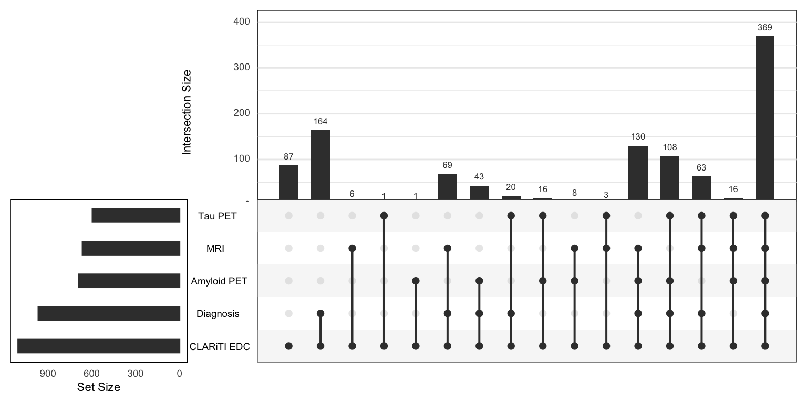

Figure 6: UpSet plot of CLARiTI participants.

Code

``` r

plot_upset(subset(dd_upset, Cohort %in% c('CLARiTI', 'SCAN')))
```

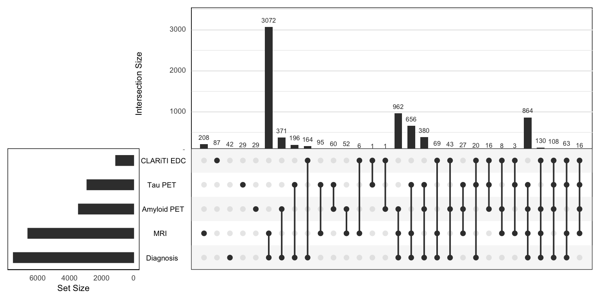

Figure 7: UpSet plot of CLARiTI and SCAN participants.

Code

``` r

plot_upset(subset(dd_upset, Cohort == 'SCAN'))
```

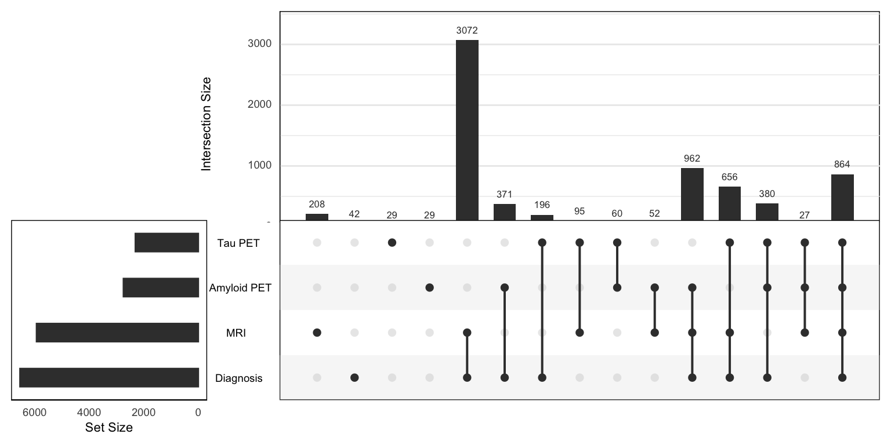

Figure 8: UpSet plot of SCAN participants (excluding CLARiTI).

Code

``` r

plot_upset(subset(dd_upset, Cohort %in% c('CLARiTI', 'SCAN', 'Mixed protocol')))
```

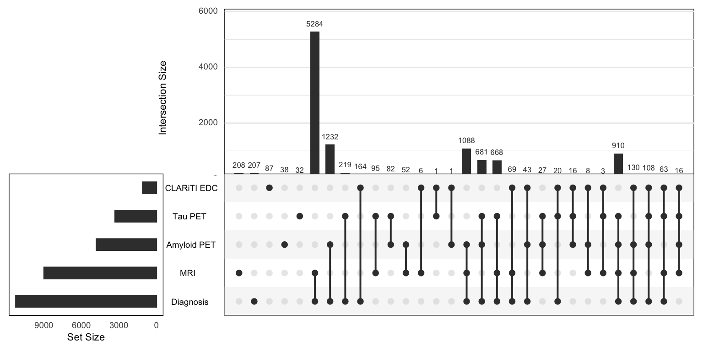

Figure 9: UpSet plot of participants with any imaging.

Code

``` r

plot_upset(dd_upset)
```

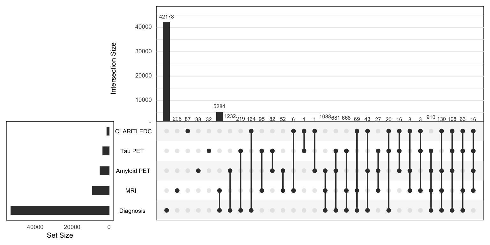

Figure 10: UpSet plot of all participants.

### Scan counts

Code

``` r

tmp <- dd %>% 
  select(NACCID, CENTILOIDS, HIPPOCAMPUS, Tau_PET_ComBat) %>%
  rename(
    `Amyloid PET` = CENTILOIDS, `Volumetric MRI` = HIPPOCAMPUS, 
    `Tau PET` = Tau_PET_ComBat) %>%
  group_by(NACCID) %>%
  pivot_longer(`Amyloid PET`:`Tau PET`) %>%
  filter(!is.na(value)) %>%
  mutate(Type = factor(name, levels = c(
    "Amyloid PET", "Tau PET", "Volumetric MRI"))) %>%
  group_by(Type, NACCID) %>%
  summarise(`Serial scans` = n())

with(tmp, table(Type, `Serial scans`)) %>% 
  knitr::kable(caption = "Number of individuals who have received the given number serial scans for each scan type.")
```

|                |    1 |    2 |   3 |   4 |   5 |   6 |   7 |   8 |   9 |  10 |
|:---------------|-----:|-----:|----:|----:|----:|----:|----:|----:|----:|----:|
| Amyloid PET    | 4152 |  582 |  59 |   7 |   1 |   0 |   0 |   0 |   0 |   0 |
| Tau PET        | 2601 |  368 |  53 |  11 |   5 |   0 |   0 |   0 |   0 |   0 |
| Volumetric MRI | 6143 | 1841 | 682 | 232 |  59 |  26 |  10 |   3 |   5 |   4 |

Table 1: Number of individuals who have received the given number serial
scans for each scan type.

### Cummulative scans by time from first scan

Code

``` r

dd %>% 
  select(NACCID, Age, Etiology, NACCUDSD, NACCETPR,
    CENTILOIDS, HIPPOCAMPUS, Tau_PET_ComBat) %>%
  rename(
    `Amyloid PET` = CENTILOIDS, `Volumetric MRI` = HIPPOCAMPUS, 
    `Tau PET` = Tau_PET_ComBat) %>%
  pivot_longer(`Amyloid PET`:`Tau PET`) %>%
  filter(!is.na(value), !is.na(Age), !is.na(NACCUDSD)) %>%
  mutate(Type = factor(name, levels = c(
    "Amyloid PET", "Tau PET", "Volumetric MRI"))) %>%
  group_by(NACCID, Type) %>%
  mutate(
    Age0 = min(Age, na.rm = TRUE),
    `Initial Dx` = case_when(
      Age == Age0 ~ NACCUDSD,
      TRUE ~ NA),
    Years = Age - Age0) %>%
  arrange(NACCID, Years) %>%
  tidyr::fill(all_of("Initial Dx"), .direction = "down") %>%
  group_by(Type, Years) %>%
  summarise(count = n()) %>%
  mutate(`Cumulative count` = cumsum(count)) %>%
ggplot(aes(x=Years, y=`Cumulative count`, color = Type)) +
  geom_line() +
  xlab('Years from first scan of each type')
```

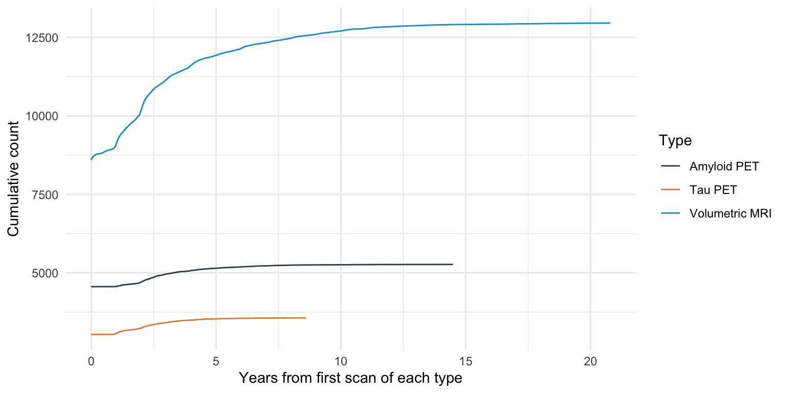

Figure 11: Cumulative scans by time from first scan of each scan type.

## Baseline characteristics

### CLARiTI participants

Code

``` r

tbl_summary(
  data = dd_cross %>% filter(Cohort == 'CLARiTI') %>%
    mutate(across(where(is.factor), fct_drop)),
  by = NACCUDSD,
  include = c("CLARiTI EDC", "Etiology", "Age", "SEX", "EDUC", "RACE", "HISPANIC", "AMYLOID_STATUS", "CENTILOIDS", "HIPPOCAMPUS", "Tau_PET", "Tau_TRACER", "PHC_MEM", "PHC_EXF", "PHC_LAN"),
  type = all_continuous() ~ "continuous2",
  statistic = list(
    all_continuous() ~ c(
      "{mean} ({sd})",
      "{median} ({p25}, {p75})",
      "{min}, {max}"),
    all_categorical() ~ "{n} ({p}%)"),
  digits = all_continuous() ~ 1,
  percent = "row",
  missing_text = "(Missing)") %>%
  add_overall(last = TRUE) %>%
  add_stat_label(label = all_continuous2() ~ c("Mean (SD)", "Median (Q1, Q3)", "Range")) %>%
  modify_caption(caption = "Characteristics of CLARiTI participants by UDS diagnosis at the visit closest to the CLARiTI visit (first consent date). Note CLARiTI participants are those with a NACCID in clariti_edc or any of the CLARiTI imaging summary files.") %>%
  modify_footnote_header(
    footnote = "Row-wise percentage; n (%)",
    columns = all_stat_cols(),
    replace = TRUE) %>%
  bold_labels()
```

[TABLE]

Table 2: Characteristics of CLARiTI participants by UDS diagnosis at the
visit closest to the CLARiTI visit (first consent date). Note CLARiTI
participants are those with a NACCID in clariti_edc or any of the
CLARiTI imaging summary files.

### Participants with any imaging

Code

``` r

tbl_summary(
  data = dd_cross %>%
    filter(Cohort != 'UDS only') %>%
    mutate(across(where(is.factor), fct_drop)),
  by = NACCUDSD,
  include = c("Etiology", "Age", "SEX", "EDUC", "RACE", "HISPANIC", "AMYLOID_STATUS", "CENTILOIDS", "HIPPOCAMPUS", "Tau_PET", "Tau_TRACER", "PHC_MEM", "PHC_EXF", "PHC_LAN"),
  type = all_continuous() ~ "continuous2",
  statistic = list(all_continuous() ~ c(
    "{mean} ({sd})",
    "{median} ({p25}, {p75})",
    "{min}, {max}"),
    all_categorical() ~ "{n} ({p}%)"),
  digits = all_continuous() ~ 1,
  percent = "row",
  missing_text = "(Missing)") %>%
  add_overall(last = TRUE) %>%
  add_stat_label(label = all_continuous2() ~ c("Mean (SD)", "Median (Q1, Q3)", "Range")) %>%
  modify_caption(caption = "Characteristics of participants with any imaging by baseline UDS diagnosis (for CLARiTI participants, the UDS visit closest to the CLARiTI visit).") %>%
  modify_footnote_header(
    footnote = "Row-wise percentage; n (%)",
    columns = all_stat_cols(),
    replace = TRUE) %>%
  bold_labels()
```

[TABLE]

Table 3: Characteristics of participants with any imaging by baseline
UDS diagnosis (for CLARiTI participants, the UDS visit closest to the
CLARiTI visit).

### All participants

Code

``` r

tbl_summary(
  data = dd_cross %>%
    mutate(across(where(is.factor), fct_drop)),
  by = NACCUDSD,
  include = c("Etiology", "Age", "SEX", "EDUC", "RACE", "HISPANIC", "AMYLOID_STATUS", "CENTILOIDS", "HIPPOCAMPUS", "Tau_PET", "Tau_TRACER", "PHC_MEM", "PHC_EXF", "PHC_LAN"),
  type = all_continuous() ~ "continuous2",
  statistic = list(all_continuous() ~ c(
    "{mean} ({sd})",
    "{median} ({p25}, {p75})",
    "{min}, {max}"),
    all_categorical() ~ "{n} ({p}%)"),
  digits = all_continuous() ~ 1,
  percent = "row",
  missing_text = "(Missing)") %>%
  add_overall(last = TRUE) %>%
  add_stat_label(label = all_continuous2() ~ c("Mean (SD)", "Median (Q1, Q3)", "Range")) %>%
  modify_caption(caption = "Characteristics of all participants by baseline UDS diagnosis (for CLARiTI participants, the UDS visit closest to the CLARiTI visit).") %>%
  modify_footnote_header(
    footnote = "Row-wise percentage; n (%)",
    columns = all_stat_cols(),
    replace = TRUE) %>%
  bold_labels()
```

[TABLE]

Table 4: Characteristics of all participants by baseline UDS diagnosis
(for CLARiTI participants, the UDS visit closest to the CLARiTI visit).

### Participants with hippocampal volumes

Code

``` r

tbl_summary(
  data = dd_cross %>% filter(!is.na(HIPPOCAMPUS)) %>%
    mutate(across(where(is.factor), fct_drop)),
  by = NACCUDSD,
  include = c("Etiology", "Age", "SEX", "EDUC", "RACE", "HISPANIC", "AMYLOID_STATUS", "CENTILOIDS", "HIPPOCAMPUS", "Tau_PET", "Tau_TRACER", "PHC_MEM", "PHC_EXF", "PHC_LAN"),
  type = all_continuous() ~ "continuous2",
  statistic = list(all_continuous() ~ c(
    "{mean} ({sd})",
    "{median} ({p25}, {p75})",
    "{min}, {max}"
  ),
    all_categorical() ~ "{n} ({p}%)"),
  digits = all_continuous() ~ 1,
  percent = "row",
  missing_text = "(Missing)") %>%
  add_overall(last = TRUE) %>%
  add_stat_label(label = all_continuous2() ~ c("Mean (SD)", 
    "Median (Q1, Q3)", "Range")) %>%
  modify_caption(caption = "Characteristics of all participants with MRI data by baseline UDS diagnosis (for CLARiTI participants, the UDS visit closest to the CLARiTI visit).") %>%
  modify_footnote_header(
    footnote = "Row-wise percentage; n (%)",
    columns = all_stat_cols(),
    replace = TRUE) %>%
  bold_labels()
```

[TABLE]

Table 5: Characteristics of all participants with MRI data by baseline
UDS diagnosis (for CLARiTI participants, the UDS visit closest to the
CLARiTI visit).

### Participants with tau PET

Code

``` r

tbl_summary(
  data = dd_cross %>% filter(!is.na(Tau_PET)) %>%
    mutate(across(where(is.factor), fct_drop)),
  by = NACCUDSD,
  include = c("Etiology", "Age", "SEX", "EDUC", "RACE", "HISPANIC", "AMYLOID_STATUS", "CENTILOIDS", "HIPPOCAMPUS", "Tau_PET", "Tau_TRACER", "PHC_MEM", "PHC_EXF", "PHC_LAN"),
  type = all_continuous() ~ "continuous2",
  statistic = list(all_continuous() ~ c(
    "{mean} ({sd})",
    "{median} ({p25}, {p75})",
    "{min}, {max}"),
    all_categorical() ~ "{n} ({p}%)"),
  digits = all_continuous() ~ 1,
  percent = "row",
  missing_text = "(Missing)") %>%
  add_overall(last = TRUE) %>%
  add_stat_label(label = all_continuous2() ~ c("Mean (SD)", "Median (Q1, Q3)", "Range")) %>%
  modify_caption(caption = "Characteristics of all participants with tau PET data by baseline UDS diagnosis (for CLARiTI participants, the UDS visit closest to the CLARiTI visit).") %>%
  modify_footnote_header(
    footnote = "Row-wise percentage; n (%)",
    columns = all_stat_cols(),
    replace = TRUE) %>%
  bold_labels()
```

[TABLE]

Table 6: Characteristics of all participants with tau PET data by
baseline UDS diagnosis (for CLARiTI participants, the UDS visit closest
to the CLARiTI visit).

### Participants with amyloid PET

Code

``` r

tbl_summary(
  data = dd_cross %>% filter(!is.na(CENTILOIDS)) %>%
    mutate(across(where(is.factor), fct_drop)),
  by = NACCUDSD,
  include = c("Etiology", "Age", "SEX", "EDUC", "RACE", "HISPANIC", "AMYLOID_STATUS", "CENTILOIDS", "HIPPOCAMPUS", "Tau_PET", "Tau_TRACER", "PHC_MEM", "PHC_EXF", "PHC_LAN"),
  type = all_continuous() ~ "continuous2",
  statistic = list(all_continuous() ~ c(
    "{mean} ({sd})",
    "{median} ({p25}, {p75})",
    "{min}, {max}"
  ),
    all_categorical() ~ "{n} ({p}%)"),
  digits = all_continuous() ~ 1,
  percent = "row",
  missing_text = "(Missing)") %>%
  add_overall(last = TRUE) %>%
  add_stat_label(label = all_continuous2() ~ c("Mean (SD)", "Median (Q1, Q3)", "Range")) %>%
  modify_caption(caption = "Characteristics of NACC ADRC participants with amyloid PET data by baseline UDS diagnosis (for CLARiTI participants, the UDS visit closest to the CLARiTI visit).") %>%
  modify_footnote_header(
    footnote = "Row-wise percentage; n (%)",
    columns = all_stat_cols(),
    replace = TRUE) %>%
  bold_labels()
```

[TABLE]

Table 7: Characteristics of NACC ADRC participants with amyloid PET data
by baseline UDS diagnosis (for CLARiTI participants, the UDS visit
closest to the CLARiTI visit).

## Summary plots

### LOESS Trends

Code

``` r

plot_loess(dd)
```

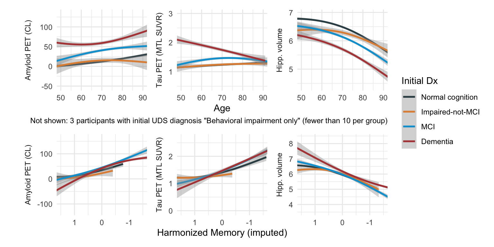

LOESS plots. For the bottom plot, memory scores are imputed using linear
interpolation (when possible) and a linear mixed effects model (when
interpolation was not possible) to allow for plotting against biomarker
values. The linear mixed effects model included fixed effects for age
(as a cubic polynomial) by initial diagnosis. Random effects included
random intercepts and slopes for each participant.

### Spaghetti plots

Code

``` r

plot_spaghetti(dd, value = "CENTILOIDS", project = "Amyloid_PROJECT",
  ylab = 'Amyloid PET (CL)', alpha = 0.5)
```

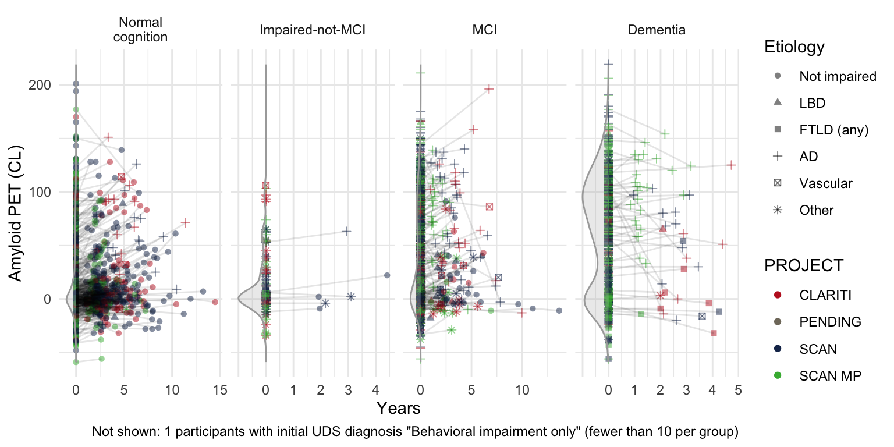

Spaghetti plot of amyloid PET.

Code

``` r

plot_spaghetti(dd, value = "Tau_PET_ComBat", project = "Tau_PROJECT",
  ylab = 'Tau PET (MTL SUVR)')
```

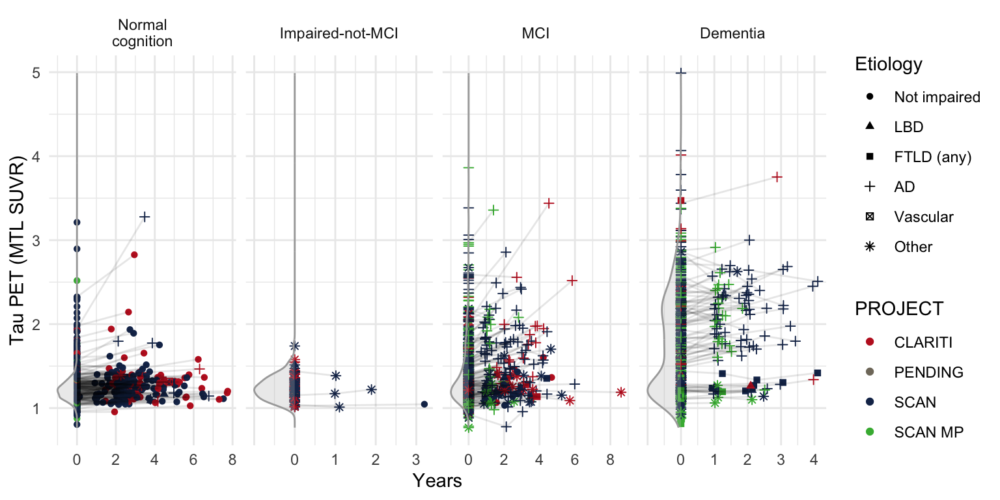

Spaghetti plot of tau PET.

Code

``` r

plot_spaghetti(dd, value = "HIPPOCAMPUS", project = "MRI_PROJECT",
  ylab = 'Hippocampal volume')
```

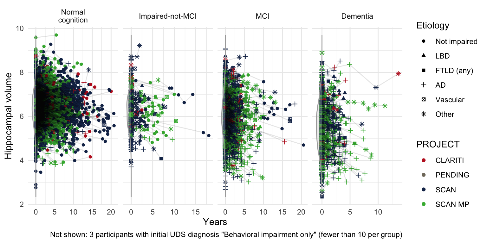

Spaghetti plot of hippocampal volumes.

Code

``` r

pd <- dd %>% 
  select(NACCID, Age, Etiology, NACCUDSD, NACCETPR,
    PHC_MEM, PHC_EXF, PHC_LAN) %>%
  rename(Memory = PHC_MEM, `Exec. Function` = PHC_EXF, Language = PHC_LAN) %>%
  add_initial_dx() %>%
  pivot_longer(Memory:Language) %>%
  filter(!is.na(value), !is.na(NACCUDSD)) %>%
  known_initial_dx()

ggplot(pd, aes(x=Years, y=value)) +
  geom_point(aes(color = Etiology), alpha=0.1) +
  geom_density(aes(y = value, 
    x = after_stat(-scaled)), 
    color = "darkgray", fill = "gray", alpha = 0.3, 
    orientation = "y", inherit.aes = FALSE) +
  scale_x_continuous(labels = function(x) ifelse(x < 0, "", x)) +
  facet_grid(name ~ `Initial Dx`, scales = 'free_y',
    labeller = label_wrap_gen(width = 15)) +
  guides(colour = guide_legend(override.aes = list(alpha=1))) +
  labs(y = '', caption = dropped_dx_caption(pd))
```

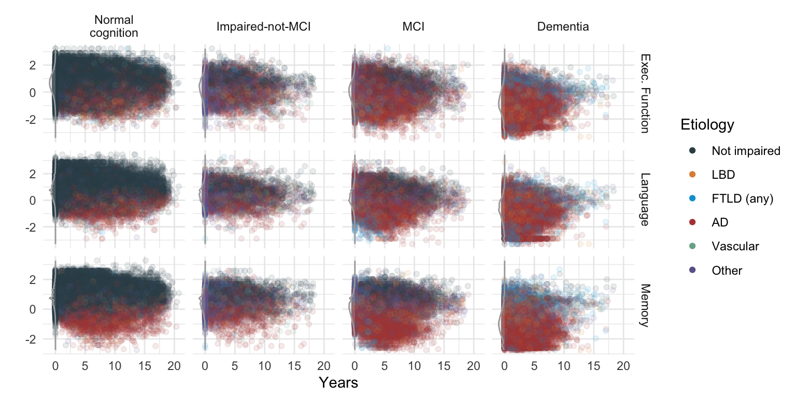

Spaghetti plot of harmonized cognitive scores.

### CLARiTI spaghetti plots from the CLARiTI visit

Time 0 is each CLARiTI participant’s CLARiTI visit (first consent date,
CNSTDT1; screening date if not available). Scans before the CLARiTI
visit, e.g. from SCAN or legacy mixed protocol imaging, have negative
times. Panels are the UDS diagnosis at the visit closest to the CLARiTI
visit.

Code

``` r

plot_spaghetti_clariti(dd, value = "CENTILOIDS", project = "Amyloid_PROJECT",
  ylab = 'Amyloid PET (CL)', alpha = 0.5)
```

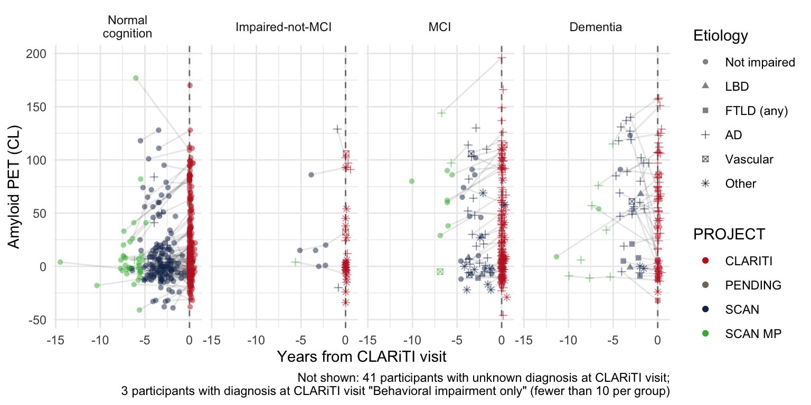

Amyloid PET of CLARiTI participants by years from the CLARiTI visit.

Code

``` r

plot_spaghetti_clariti(dd, value = "Tau_PET_ComBat", project = "Tau_PROJECT",
  ylab = 'Tau PET (MTL SUVR)')
```

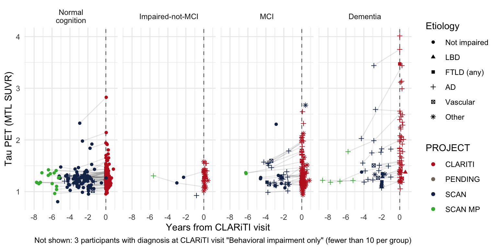

Tau PET of CLARiTI participants by years from the CLARiTI visit.

Code

``` r

plot_spaghetti_clariti(dd, value = "HIPPOCAMPUS", project = "MRI_PROJECT",
  ylab = 'Hippocampal volume (cm3)')
```

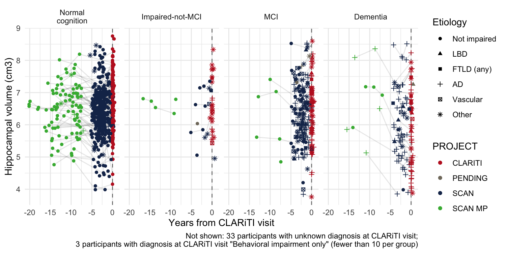

Hippocampal volumes of CLARiTI participants by years from the CLARiTI
visit.

### ComBat Harmonization of tau PET (tracers)

Code

``` r

ggplot(dd %>% filter(!is.na(Tau_PET_ComBat)), 
  aes(x = Tau_PET, y = Tau_PET_ComBat, color = Tau_TRACER)) +
  geom_point() +
  geom_abline(intercept = 0, slope = 1, linetype = 'dashed')
```

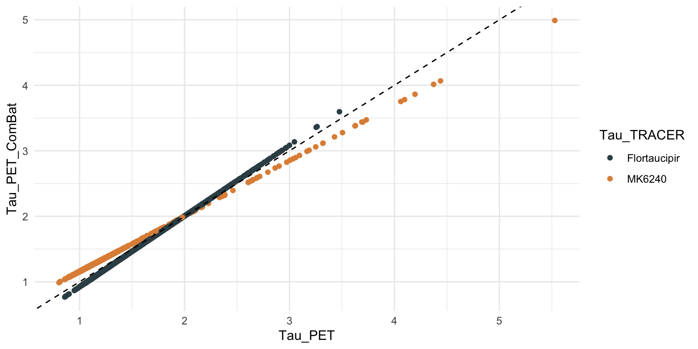

ComBat transformed versus raw Tau PET data by tracer.

## Publishing with NACC Data

See the [author
checklist](https://www.naccdata.org/publish-with-nacc-data) for more
information. If you use the `NACCADRC` R data package, please also cite
([Donohue et al. 2026](#ref-donohue2026alzheimer)).

### Funding

Work on this `R` package was funded by CLARiTI (NIH U01 AG082350). The
NACC database is funded by NIA/NIH Grant U24 AG072122. SCAN was funded
by NIA/NIH U24 AG067418. See
[naccdata.org](https://www.naccdata.org/publish-with-nacc-data) for more
information.

## References

Donohue, Michael C, Kedir Hussen, Oliver Langford, Richard Gallardo,
Gustavo Jimenez-Maggiora, Paul S Aisen, and Alzheimer’s Disease
Neuroimaging Initiative. 2026. “Alzheimer’s clinical research data via R
packages: The alzverse.” *Alzheimer’s & Dementia* 22 (2): e71152.
<https://doi.org/10.1002/alz.71152>.
